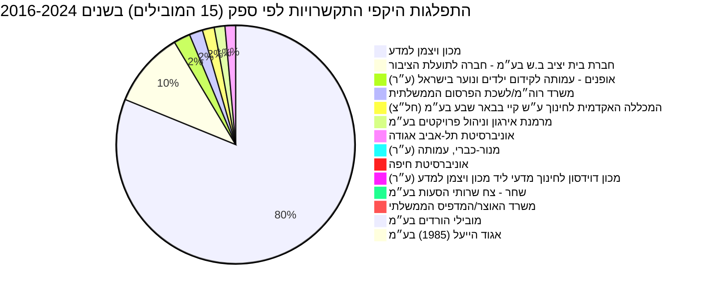
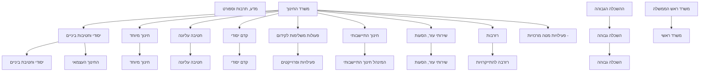

# נתוני תקציב, התקשרויות והחלטות ממשלה בתחום מרכזי מצוינות

Based on the analysis of budget items, contracts, and government decisions, the topic of "מרכזי מצוינות" (Excellence Centers) primarily spans the Ministry of Education, Higher Education, and, to a lesser extent, the Prime Minister's Office and Science, Culture & Sport. The data covers a period from 1997 to 2026, with the most active budget items, such as [תכניות לקידום מצוינות במתמטיקה, מדעים ושפות (20.67.01.83)](https://next.obudget.org/i/4165504dfac6) under the [משרד החינוך (20)](https://next.obudget.org/i/036b4c2b2c96), showing a revised budget of ₪15.35 million in 2025.
The total allocated budget for related items across all years is ₪596,289,000, with a revised total of ₪486,051,000 and ₪233,475,814 used. Many older budget items appear dormant with zero allocation in recent years.
Key entities involved in contracts related to excellence programs include [מכון ויצמן למדע](https://next.obudget.org/i/org/company/520016858), [חברת בית יציב ב.ש בע״מ - חברה לתועלת הציבור](https://next.obudget.org/i/org/association/510237894), and [אופנים - עמותה לקידום ילדים ונוער בישראל (ע״ר)](https://next.obudget.org/i/org/association/580418408), primarily for educational initiatives in mathematics, science, and technology. Government decisions touch upon promoting excellence in STEM, digital transformation, and fostering innovation, reflecting a broader governmental interest in these areas.

## מגמה תקציבית לאורך זמן

The search was initiated using the terms "מרכז מצוינות" (excellence center) and "מצוינות" (excellence). Initial full-text search results for "מרכז מצוינות" included many irrelevant "מרכז רפואי" (medical center) entries, which were filtered out. The scope of the search was expanded to include `functional_class_detailed` categories of 'השכלה גבוהה' (Higher Education), 'חינוך' (Education), and 'מדע, תרבות וספורט' (Science, Culture and Sport), as well as specific budget offices. Development budget codes for education (60) and Prime Minister's Office (89) were also checked, but no relevant items were found within these development budgets.

Codes `20.31.03.07` ("רזרבה לקידום מצוינות" - Reserve for promoting excellence) and `78.04.01.15` ("השתתפות משרד רוה"מ בתוכנית למצוינות" - Participation of the Prime Minister's Office in an excellence program) were identified in initial searches but were discarded. `20.31.03.07` was identified as a general reserve under "תרבות" (culture) and not a specific center or program. `78.04.01.15` was under tourism development and not directly related to 'excellence centers'.

Many of the selected budget items show `amount_allocated`, `amount_revised`, and `amount_used` as 0.0 or NULL in their latest active years, indicating they are dormant or historical entries with no current budget allocation. Specifically, `amount_allocated` is NULL for 2020 because there was no approved budget that year, and `amount_used` is NULL for 2026 as the budget year has not yet concluded.

The coverage window for the data is from 1997 to 2026. All figures are reported in New Israeli Shekels (₪).

| שנה | תקציב מאושר (₪) | תקציב מעודכן (₪) | תקציב מנוצל (₪) | מספר פריטים |
|---|---|---|---|---|
| 1997 | 0.0 | 0.0 | 0.0 | 1 |
| 2000 | 570000.0 | 570000.0 | 570000.0 | 1 |
| 2001 | 0.0 | 0.0 | 0.0 | 1 |
| 2002 | 0.0 | 0.0 | 0.0 | 1 |
| 2003 | 0.0 | 0.0 | 0.0 | 1 |
| 2004 | 0.0 | 0.0 | 0.0 | 1 |
| 2005 | 0.0 | 300000.0 | 289841.0 | 1 |
| 2006 | 907000.0 | 796000.0 | 795841.0 | 1 |
| 2007 | 1573000.0 | 5618000.0 | 749730.0 | 3 |
| 2008 | 1323000.0 | 1157000.0 | 907270.0 | 2 |
| 2009 | 1059000.0 | 518000.0 | 518000.0 | 2 |
| 2010 | 1046000.0 | 725000.0 | 232000.0 | 1 |
| 2011 | 41021000.0 | 1214000.0 | 699998.0 | 2 |
| 2012 | 60998000.0 | 29589000.0 | 29288683.0 | 2 |
| 2013 | 23469000.0 | 23200000.0 | 23199628.0 | 3 |
| 2014 | 34355000.0 | 34003000.0 | 33500000.0 | 3 |
| 2015 | 77413000.0 | 67689000.0 | 43233173.0 | 4 |
| 2016 | 73119000.0 | 59514000.0 | 52212007.0 | 4 |
| 2017 | 93514000.0 | 62790000.0 | 39135277.0 | 3 |
| 2018 | 94799000.0 | 72495000.0 | 37372632.0 | 3 |
| 2019 | 110645000.0 | 66859000.0 | 35708374.0 | 2 |
| 2020 | | 47238000.0 | 27030700.0 | 3 |
| 2021 | 39067000.0 | 40835000.0 | 13793279.0 | 3 |
| 2022 | 37837000.0 | 36085000.0 | 17627270.0 | 1 |
| 2023 | 11306000.0 | 35335000.0 | 14488540.0 | 1 |
| 2024 | 34777000.0 | 31191000.0 | 18494179.0 | 1 |
| 2025 | 0.0 | 15350000.0 | 6591382.0 | 1 |
| 2026 | 0.0 | 0.0 | | 1 |

## תכניות פעילות כיום

### התפלגות היקפי התקשרויות לפי ספק (15 הספקים המובילים) בשנים 2016-2024

## מקורות תקציב

Here is the hierarchical budget breakdown and program structures for 'מרכזי מצוינות' related items for 2026, based on the provided data. This flowchart illustrates the top-level ministries and their relevant sub-categories up to level 3, showing the structure under which excellence-related programs are budgeted. Please note that not all items in these high-level categories directly relate to "excellence centers" but represent the broader budgetary context.

### רשימת סעיפי תקציב נבחרים (עם קישורים)
*   [משרד החינוך (20)](https://next.obudget.org/i/036b4c2b2c96)
    *   [יסודי וחטיבות ביניים (20.63)](https://next.obudget.org/i/af8a301c5281)
        *   [יסודי וחטיבת ביניים (20.63.01)](https://next.obudget.org/i/61828b042c1d)
        *   [החינוך העצמאי (20.63.02)](https://next.obudget.org/i/abecc63e6029)
    *   [חינוך מיוחד (20.61)](https://next.obudget.org/i/cd241ab4b3eb)
        *   [חינוך מיוחד (20.61.01)](https://next.obudget.org/i/5f0e1ea4e892)
    *   [חטיבה עליונה (20.64)](https://next.obudget.org/i/cea966803b04)
        *   [חטיבה עליונה (20.64.01)](https://next.obudget.org/i/7aa0e8c9c60a)
    *   [קדם יסודי (20.62)](https://next.obudget.org/i/51d371a81838)
        *   [קדם יסודי (20.62.01)](https://next.obudget.org/i/1d3ea721b416)
    *   [פעולות משלימות לקידום (20.67)](https://next.obudget.org/i/0a08491aed3d)
        *   [פעילויות ופרוייקטים (20.67.01)](https://next.obudget.org/i/7020f5057c16)
    *   [חינוך התיישבותי (20.66)](https://next.obudget.org/i/912ba2713394)
        *   [המינהל חינוך התיישבותי (20.66.01)](https://next.obudget.org/i/5b33bd4b576f)
    *   [שירותי עזר, הסעות (20.65)](https://next.obudget.org/i/c8aeff74b890)
        *   [שירותי עזר, הסעות (20.65.01)](https://next.obudget.org/i/8227e7ee8f6d)
    *   [רזרבות (20.70)](https://next.obudget.org/i/78da2426aada)
        *   [רזרבה להתייקרויות (20.70.01)](https://next.obudget.org/i/4bba6a2d9c20)
    *   [פעילויות מטה מרכזיות - (20.60.01)](https://next.obudget.org/i/08da73837bb8)
*   [ההשכלה הגבוהה (21)](https://next.obudget.org/i/337a76d779bb)
    *   [השכלה גבוהה (21.11)](https://next.obudget.org/i/42d08405c380)
        *   [השכלה גבוהה (21.11.01)](https://next.obudget.org/i/c12865162701)
*   [משרד ראש הממשלה (04)](https://next.obudget.org/i/fb3dc8fc5306)
    *   [משרד ראשי (04.51)](https://next.obudget.org/i/2640248ea7dd)
*   [מדע, תרבות וספורט (19)](https://next.obudget.org/i/eaeac1cae0aa)

## נושאים נוספים

### התקשרויות/חוזים
להלן פירוט ההתקשרויות וסכומי הספקים הכוללים עבור הנושא 'מרכז מצוינות':

**התקשרויות מובילות לפי נפח (50 המובילות):**

| ייעוד | משרד רוכש | שם ספק | היקף (₪) | בוצע (₪) | שנת התחלה | שנת סיום | קישור לפריט |
|---|---|---|---|---|---|---|---|
| מיזם משותף להקמת מכון להוראת מתקדמת במתמטיקה ומדעים | משרד החינוך | מכון ויצמן למדע | 23120232.0 | 0.0 | 2018 | 2023 | [Link](https://next.obudget.org/i/0450c8aad3ef) |
| מיזם משותף להקמת מכון להוראת מתקדמת במתמטיקה ומדעים | משרד החינוך | מכון ויצמן למדע | 14549865.0 | 0.0 | 2018 | 2023 | [Link](https://next.obudget.org/i/d3172b57b7a9) |
| מכרז 43/11.2018 הפעלת פרויקטים חינוכיים לחיזוק וקידום החינוך הטכנולוגי והמדעי במחוז דרום ו | משרד החינוך | חברת [בית יציב ב.ש בע״מ - חברה לתועלת הציבור](https://next.obudget.org/i/org/association/510237894) | 5081321.59 | 0.0 | 2023 | 2023 | [Link](https://next.obudget.org/i/6f0eb2d875af) |
| מיזם משותף בנושא התכנית הלאומית לקידום מצוינות בפריפריה, שנה"ל תשפ"ד | משרד החינוך | [אופנים - עמותה לקידום ילדים ונוער בישראל (ע״ר)](https://next.obudget.org/i/org/association/580418408) | 1114750.0 | 0.0 | 2023 | 2024 | [Link](https://next.obudget.org/i/ace43db135ab) |
| מכרז מ.37/12.2019 פיתוח תשתיות למו"פ יזמות וחדשנות במערכת החינוך | משרד החינוך | [מרמנת אירגון וניהול פרויקטים בע״מ](https://next.obudget.org/i/org/company/512027129) | 716366.82 | 0.0 | 2023 | 2024 | [Link](https://next.obudget.org/i/e56a23689c9f) |
| מכרז 9/7.2013:הקמה והפעלה של מרכז מורים למו"ט תשעח- הרחבה | משרד החינוך | [אוניברסיטת תל-אביב אגודה](https://next.obudget.org/i/org/ottoman-association/589931187) | 712230.01 | 712230.0 | 2017 | 2018 | [Link](https://next.obudget.org/i/968966a56549) |
| מכרז 9/7.2013:הקמה והפעלה של מרכז מורים לכימיה על יסודי תשע"ח-הרחבה | משרד החינוך | מכון ויצמן למדע | 557785.2 | 0.0 | 2017 | 2018 | [Link](https://next.obudget.org/i/1c94ee5a6adf) |
| מכרז 9/7.2013: הקמה הפעלה של מרכז מורים לביולוגיה תשע"ח-הרחבה | משרד החינוך | מכון ויצמן למדע | 522713.8 | 251843.38 | 2017 | 2018 | [Link](https://next.obudget.org/i/7b00f8693a2c) |
| מכרז 9/7.2013: הקמה והפעלה של מרכז מורים למו"ט ומוט"ב לתשע"ח-הרחבה | משרד החינוך | מכון ויצמן למדע | 502200.0 | 0.0 | 2017 | 2018 | [Link](https://next.obudget.org/i/84a76b135b9e) |
| פרסום קמפיין - תכנית האנגלית בבתי"ס בחמ"ד | משרד החינוך | [משרד רוה״מ/לשכת הפרסום הממשלתית](https://next.obudget.org/i/org/government_office/500100268) | 500000.0 | 157545.22 | 2017 | 2017 | [Link](https://next.obudget.org/i/3d079f7c2a75) |
| מכרז 9/7.2013: הפעלת מרכז מורים לפיזיקה ומדעי כדו"א לתשע"ח-הרחבה | משרד החינוך | מכון ויצמן למדע | 499880.0 | 278760.0 | 2017 | 2018 | [Link](https://next.obudget.org/i/c4728b681493) |
| הקמה והפעלה של מרכז מורים למו"ט ומוט"ל תשע"ט. במסגרת מכרז 9/7.2013 | משרד החינוך | מכון ויצמן למדע | 447000.0 | 0.0 | 2018 | 2019 | [Link](https://next.obudget.org/i/10c2e9b4d514) |
| מיזם משותף עם עמותת מנור כברי - מודל אחר"ת - פיזיקה - תשע"ט | משרד החינוך | [מנור-כברי, עמותה (ע״ר)](https://next.obudget.org/i/org/association/580322337) | 421660.0 | 420221.61 | 2018 | 2019 | [Link](https://next.obudget.org/i/f3ab2875b881) |
| פרסום קמפיין גיוס מורים להוראת האנגלית | משרד החינוך | [משרד רוה״מ/לשכת הפרסום הממשלתית](https://next.obudget.org/i/org/government_office/500100268) | 400000.0 | 381386.0 | 2016 | 2018 | [Link](https://next.obudget.org/i/2951519c6568) |
| הפעלת שעשועון החידות הבינלאומי במתמטיקה "קנגרו" לתלמידי כיתות ד' - תשע"ט | משרד החינוך | [המכללה האקדמית לחינוך ע״ש קיי בבאר שבע בע״מ (חל״צ)](https://next.obudget.org/i/org/association/511262669) | 399900.0 | 399900.0 | 2018 | 2019 | [Link](https://next.obudget.org/i/41a9179a79c7) |
| הפעלת שעשועון מתמטי בינלאומי קנגורו לתלמידי כיתות | משרד החינוך | [המכללה האקדמית לחינוך ע״ש קיי בבאר שבע בע״מ (חל״צ)](https://next.obudget.org/i/org/association/511262669) | 399500.0 | 155130.0 | 2016 | 2018 | [Link](https://next.obudget.org/i/a9a59e63527f) |
| 9/7.2013 הקמה והפעלה של מרכז מורים ארצי למתמטיקה על יסודי תשע"ח-הרחבה | משרד החינוך | [אוניברסיטת חיפה](https://next.obudget.org/i/org/university/500701628) | 199152.0 | 0.0 | 2017 | 2018 | [Link](https://next.obudget.org/i/aa43f484d3de) |
| תכנית לימוד כימיה 5 יח"ל ברשת לשנה"ל תשע"ט | משרד החינוך | [מכון דוידסון לחינוך מדעי ליד מכון ויצמן למדע (ע״ר)](https://next.obudget.org/i/org/association/580335818) | 50104.0 | 50098.0 | 2018 | 2019 | [Link](https://next.obudget.org/i/b84e9e90564a) |
| מ.מ. 2015-05 (אזור 2) - מפגש מוזיקלי שיר של יום באנגלית בתאריך-29.3.2020 | משרד החינוך | [שחר - צח שרותי הסעות בע״מ](https://next.obudget.org/i/org/company/512339011) | 10880.15 | 0.0 | 2020 | 2020 | [Link](https://next.obudget.org/i/9fb19c452816) |
| הדפסת תכנית לימודים מתמטיקה לכיתות א'-ו' | משרד החינוך | [משרד האוצר/המדפיס הממשלתי](https://next.obudget.org/i/org/government_office/500100250) | 10300.0 | 0.0 | 2017 | 2017 | [Link](https://next.obudget.org/i/a0a789c4d32a) |
| מ.מ. 05-2015 (אזור 1) - מפגש מוזיקלי שיר של יום באנגלית בתאריך-29.3.2020 | משרד החינוך | [מובילי הורדים בע״מ](https://next.obudget.org/i/org/company/511476905) | 7453.98 | 0.0 | 2020 | 2020 | [Link](https://next.obudget.org/i/bfec0f59d0cf) |
| מכרז 41/12.2014ושא: מתן שירות ריכוזי, תאום ובקרה של פעילויות מתמטיקה, מדעים וטכמולוגיה | משרד החינוך | [אגוד הייעל (1985) בע״מ](https://next.obudget.org/i/org/company/511060212) | 1989.0 | 2033.05 | 2019 | 2019 | [Link](https://next.obudget.org/i/27d437f7bff8) |

### ספקים
**ספקים מובילים לפי נפח התקשרות כולל:**

| שם ספק | מזהה ספק | סוג ישות ספק | סכום כולל (₪) | קישור לדף ספק |
|---|---|---|---|---|
| [מכון ויצמן למדע](https://next.obudget.org/i/org/company/520016858) | 520016858 | company | 40199676.0 | [Link](https://next.obudget.org/i/org/company/520016858) |
| [חברת בית יציב ב.ש בע״מ - חברה לתועלת הציבור](https://next.obudget.org/i/org/association/510237894) | 510237894 | association | 5081321.59 | [Link](https://next.obudget.org/i/org/association/510237894) |
| [אופנים - עמותה לקידום ילדים ונוער בישראל (ע״ר)](https://next.obudget.org/i/org/association/580418408) | 580418408 | association | 1114750.0 | [Link](https://next.obudget.org/i/org/association/580418408) |
| [משרד רוה״מ/לשכת הפרסום הממשלתית](https://next.obudget.org/i/org/government_office/500100268) | 500100268 | government_office | 900000.0 | [Link](https://next.obudget.org/i/org/government_office/500100268) |
| [המכללה האקדמית לחינוך ע״ש קיי בבאר שבע בע״מ (חל״צ)](https://next.obudget.org/i/org/association/511262669) | 511262669 | association | 799400.0 | [Link](https://next.obudget.org/i/org/association/511262669) |
| [מרמנת אירגון וניהול פרויקטים בע״מ](https://next.obudget.org/i/org/company/512027129) | 512027129 | company | 716366.82 | [Link](https://next.obudget.org/i/org/company/512027129) |
| [אוניברסיטת תל-אביב אגודה](https://next.obudget.org/i/org/ottoman-association/589931187) | 589931187 | ottoman-association | 712230.01 | [Link](https://next.obudget.org/i/org/ottoman-association/589931187) |
| [מנור-כברי, עמותה (ע״ר)](https://next.obudget.org/i/org/association/580322337) | 580322337 | association | 421660.0 | [Link](https://next.obudget.org/i/org/association/580322337) |
| [אוניברסיטת חיפה](https://next.obudget.org/i/org/university/500701628) | 500701628 | university | 199152.0 | [Link](https://next.obudget.org/i/org/university/500701628) |
| [מכון דוידסון לחינוך מדעי ליד מכון ויצמן למדע (ע״ר)](https://next.obudget.org/i/org/association/580335818) | 580335818 | association | 50104.0 | [Link](https://next.obudget.org/i/org/association/580335818) |
| [שחר - צח שרותי הסעות בע״מ](https://next.obudget.org/i/org/company/512339011) | 512339011 | company | 10880.15 | [Link](https://next.obudget.org/i/org/company/512339011) |
| [משרד האוצר/המדפיס הממשלתי](https://next.obudget.org/i/org/government_office/500100250) | 500100250 | government_office | 10300.0 | [Link](https://next.obudget.org/i/org/government_office/500100250) |
| [מובילי הורדים בע״מ](https://next.obudget.org/i/org/company/511476905) | 511476905 | company | 7453.98 | [Link](https://next.obudget.org/i/org/company/511476905) |
| [אגוד הייעל (1985) בע״מ](https://next.obudget.org/i/org/company/511060212) | 511060212 | company | 1989.0 | [Link](https://next.obudget.org/i/org/company/511060212) |

### החלטות ממשלה
Here are the government decisions related to 'excellence-center':

| כותרת | ממשלה | מספר החלטה | תאריך פרסום | קישור לפריט |
|---|---|---|---|---|
| מתן אישור לחברת "רפאל מערכות לחימה מתקדמות בע"מ" להקים חברה באוסטרליה | הממשלה ה- 34, בנימין נתניהו | 2146 | 2016-12-08 | [Link](https://next.obudget.org/i/024b1196e982) |
| מדיניות ממשלתית לקידום שילובם של אזרחי ישראל ממוצא אתיופי בחברה הישראלית | None | 324 | 2015-07-31 | [Link](https://next.obudget.org/i/cd6c30cb692a) |
| הקמת מועדוניות חברתיות למדעים ולטכנולוגיה | None | 1518 | 2014-03-27 | [Link](https://next.obudget.org/i/468e3df45d0c) |
| אישור לחברת התעשייה האווירית לישראל בע"מ לרכוש מניות בחברת תור טיס אחזקות בע"מ ולרכוש זכויות בשותפות תור אימון טיסה מתקדם | None | 1491 | 2014-03-21 | [Link](https://next.obudget.org/i/0d85a29ec271) |
| הרחבת תחומי פעילות התקשוב הממשלתי, עידוד חדשנות במגזר הציבורי וקידום המיזם הלאומי "ישראל דיגיטלית" | None | 2097 | 2014-10-10 | [Link](https://next.obudget.org/i/40fc13cb2218) |
| פרס ראש הממשלה ליזמות ולחדשנות | None | 1198 | 2014-01-19 | [Link](https://next.obudget.org/i/18ad81358f88) |
| הקמת חברה במקסיקו שתהיה בבעלות מלאה של חברת "רפאל מערכות לחימה מתקדמות בע"מ" | None | 2000 | 2014-09-04 | [Link](https://next.obudget.org/i/99fbe3c5ae4b) |
| כלי סיוע לטיפול בעוני וליצירת שוויון הזדמנויות | None | 361 | 2015-08-05 | [Link](https://next.obudget.org/i/96091532593c) |
| מתן אישור לאלתא מערכות בע"מ לרכוש 30% מהון המניות של חברת פולאריס סולושיינס בע"מ | הממשלה ה- 35, בנימין נתניהו | 837 | 2021-02-24 | [Link](https://next.obudget.org/i/92879648ac81) |
| פיתוח כלכלי של מחוז הצפון וצעדים משלימים לעיר חיפה | הממשלה ה- 34, בנימין נתניהו | 2262 | 2017-01-08 | [Link](https://next.obudget.org/i/7cf010b32ba4) |
| תכנית לפיתוח ולהעצמת היישובים הדרוזיים והצ'רקסיים לשנים 2016 - 2019 | הממשלה ה- 34, בנימין נתניהו | 959 | 2016-01-10 | [Link](https://next.obudget.org/i/ab2d824a603a) |
| "עתודות לישראל" - תכנית אסטרטגית לבניית עתודות הון אנושי למגזר משרתי הציבור בישראל | הממשלה ה- 34, בנימין נתניהו | 1653 | 2016-07-10 | [Link](https://next.obudget.org/i/aa6e1849bc43) |
| מתן אישור לתעשייה האווירית לישראל בע"מ לרכוש 50% מהון המניות של חברת בלובירד אירו סיסטמס בע"מ | הממשלה ה- 35, בנימין נתניהו | 836 | 2021-02-24 | [Link](https://next.obudget.org/i/f79795f57c3b) |
| הרחבת תחומי פעילות התקשוב הממשלתי, עידוד חדשנות במגזר הציבורי וקידום המיזם הלאומי "ישראל דיגיטלית" - תיקון החלטת ממשלה | הממשלה ה- 34, בנימין נתניהו | 677 | 2015-11-12 | [Link](https://next.obudget.org/i/6a129b553c83) |
| חיזוק הקשרים הכלכליים ושיתופי הפעולה עם מדינות יבשת אפריקה | הממשלה ה- 34, בנימין נתניהו | 1585 | 2016-06-26 | [Link](https://next.obudget.org/i/fb60b5cf019d) |
| תכנית ממשלתית להעצמה ולחיזוק כלכלי-חברתי של היישובים הבדואים בצפון לשנים 2016 - 2020 | הממשלה ה- 34, בנימין נתניהו | 1480 | 2016-06-02 | [Link](https://next.obudget.org/i/d88098180da2) |
| תכנית לפיתוח ולהעצמת היישובים הדרוזיים והצ'רקסיים לשנים 2016 - 2020 | None | 59 | 2015-06-07 | [Link](https://next.obudget.org/i/13d2a3ea7a3f) |
| בחירת הנושא המרכזי לשנת העצמאות ה-67 של מדינת ישראל | None | 2385 | 2015-01-01 | [Link](https://next.obudget.org/i/e1919e88a5c2) |
| מתן אישור לחברת התעשייה האווירית לישראל בע"מ להקמת חברה יעודית שתאוגד בברזיל | None | 1869 | 2014-07-18 | [Link](https://next.obudget.org/i/c2581840cebf) |
| מדיניות ממשלתית לשילובם של אזרחי ישראל ממוצא אתיופי בחברה הישראלית - המשך הפעלת תוכניות משרדי הממשלה, הארכת תקופת פעילותו של מטה היישום ותיקון החלטות ממשלה | הממשלה ה- 37 | 3243 | 2025-07-15 | [Link](https://next.obudget.org/i/f50dce480557) |
| תכנית אסטרטגית רב-שנתית לפיתוח שדרות ויישובי עוטף עזה | None | 2017 | 2014-09-21 | [Link](https://next.obudget.org/i/641bbb9d1225) |
| תכנית רב שנתית לפיתוח מצפה רמון | הממשלה ה- 34, בנימין נתניהו | 917 | 2015-12-31 | [Link](https://next.obudget.org/i/b36189ceb6f1) |
| התאמות בתקציב מערכת ההשכלה הגבוהה | הממשלה ה- 34, בנימין נתניהו | 1905 | 2016-08-11 | [Link](https://next.obudget.org/i/0893ee511900) |
| המשך חיזוק היחסים עם הרפובליקה של הודו ותיקון החלטת ממשלה | הממשלה ה- 37 | 3911 | 2026-02-22 | [Link](https://next.obudget.org/i/043e6eba6b1b) |
| האצת הדיגיטציה, יכולות הדאטה והבינה המלאכותית בממשלה באמצעות ענן ציבורי נימבוס ותיקון החלטות ממשלה | הממשלה ה- 37 | 3574 | 2025-12-04 | [Link](https://next.obudget.org/i/bb90a8d47716) |
| חיזוק הקשרים עם הרפובליקה של הודו | הממשלה ה- 34, בנימין נתניהו | 2783 | 2017-06-25 | [Link](https://next.obudget.org/i/c9df8ade3256) |
| שיפור מצבם הכלכלי של הקשישים בישראל | הממשלה ה- 34, בנימין נתניהו | 1885 | 2016-08-11 | [Link](https://next.obudget.org/i/d27333a5ed81) |
| תכנית לפיתוח כלכלי חברתי בקרב האוכלוסייה הבדואית בנגב 2021-2017 | הממשלה ה- 34, בנימין נתניהו | 2397 | 2017-02-12 | [Link](https://next.obudget.org/i/e06c99332653) |
| ישראל ריאלית: תוכנית רב-שנתית למתן מענה למצב החירום הלאומי במקצועות ה-STEM לשנים תשפ"ה-תש"ץ | הממשלה ה- 37 | 2983 | 2025-04-27 | [Link](https://next.obudget.org/i/61cf6d48a350) |
| חיזוק שיתופי הפעולה הבין-לאומיים בתחומי המדע ומשיכת חוקרים לאקדמיה ולתעשייה | הממשלה ה- 37 | 1819 | 2024-06-06 | [Link](https://next.obudget.org/i/a09d3bb69bce) |

## מקורות
*   **סעיפי תקציב**:
    *   [תכניות לקידום מצוינות במתמטיקה, מדעים ושפות](https://next.obudget.org/i/4165504dfac6) (הפריט המרכזי שזוהה)
    *   [משרד החינוך (קבוצת-על)](https://next.obudget.org/i/036b4c2b2c96)
*   **התקשרויות**:
    *   [כלל נתוני ההתקשרויות (להורדה)](https://next.obudget.org/api/download?query=U0VMRUNUIHB1cnBvc2UsIHB1cmNoYXNpbmdfbWluaXN0cnksIHN1cHBsaWVyX2VudGl0eV9uYW1lLCB2b2x1bWUsIGV4ZWN1dGVkLCBzdGFydF95ZWFyLCBlbmRfeWVhciwgaXRlbV91cmwgRlJPTSBjb250cmFjdHNfZGF0YSBXSEVSRSBidWRnZXRfY29kZSBJTiAoJzIwLjY3LjAxLjgzJywgJzIwLjQ2LjA2LjI1JywgJzIwLjQ2LjA2LjI2JywgJzIxLjExLjAxLjAzJywgJzIxLjAyLjAxLjYwJywgJzIwLjI2LjE1LjUxJywgJzIwLjI2LjE1LjQ3JywgJzIwLjI2LjE1LjUwJywgJzE5LjMyLjA1LjIxJywgJzA0LjA2LjAyLjAxJykgQU5EIHN0YXJ0X3llYXIgPD0gMjAyNiBBTkQgZW5kX3llYXIgPj0gMjAxNiBPUkRFUiBCWSB2b2x1bWUgREVTQyBMSU1JVCA1MA%3D%3D&headers=purpose%3Bpurchasing_ministry%3Bsupplier_entity_name%3Bvolume%3Bexecuted%3Bstart_year%3Bend_year%3Bitem_url)
*   **ספקים**:
    *   [כלל נתוני הספקים המצרפיים (להורדה)](https://next.obudget.org/api/download?query=U0VMRUNUIHN1cHBsaWVyX2VudGl0eV9uYW1lLCBzdXBwbGllcl9lbnRpdHlfaWQsIHN1cHBsaWVyX2VudGl0eV9raW5kLCBTVU0odm9sdW1lKSBBUyB0b3RhbF92b2x1bWUgRlJPTSBjb250cmFjdHNfZGF0YSBXSEVSRSBidWRnZXRfY29kZSBJTiAoJzIwLjY3LjAxLjgzJywgJzIwLjQ2LjA2LjI1JywgJzIwLjQ2LjA2LjI2JywgJzIxLjExLjAxLjAzJywgJzIxLjAyLjAxLjYwJywgJzIwLjI2LjE1LjUxJywgJzIwLjI2LjE1LjQ3JywgJzIwLjI2LjE1LjUwJywgJzE5LjMyLjA1LjIxJywgJzA0LjA2LjAyLjAxJykgQU5EIHN0YXJ0X3llYXIgPD0gMjAyNiBBTkQgZW5kX3llYXIgPj0gMjAxNiBHUk9VUCBCWSBzdXBwbGllcl9lbnRpdHlfbmFtZSwgc3VwcGxpZXJfeW50aXR5X2lkLCBzdXBwbGllcl9lbnRpdHlfa2luZCBPUkRFUiBCWSB0b3RhbF92b2x1bWUgREVTQyBMSU1JVCA1MA%3D%3D&headers=supplier_entity_name%3Bsupplier_entity_id%3Bsupplier_entity_kind%3Btotal_volume)
*   **החלטות ממשלה**:
    *   [כלל החלטות הממשלה הקשורות (להורדה)](https://next.obudget.org/api/download?query=U0VMRUNUIHRpdGxlLCBnb3Zlcm5tZW50LCBkZWNpc2lvbl9udW1iZXIsIHB1YmxpY2F0aW9uX2RhdGUsIGl0ZW1fdXJsIEZST00gZ292ZXJubWVudF9kZWNpc2lvbnNfZGF0YSBXSEVSRSB0aXRsZSBJTElLRSAnJSlf2YDcjNmjINCy2YHZhtil2Ycg2YXYp9mI2LElJScgT1JERVJCWSBwdWJsaWNhdGlvbl9kYXRlIERFU0MgTElNSVQgNTA%3D&headers=title%3Bgovernment%3Bdecision_number%3Bpublication_date%3Bitem_url)

[חזרה לעמוד הראשי](../../README.md)

<!-- orchestrator:related-reports:start -->

## דוחות קשורים

- [נתוני תקציב, התקשרויות והחלטות ממשלה בתחום מצוינות בפריפריה](../excellence-periphery/excellence-periphery.md)

<!-- orchestrator:related-reports:end -->
