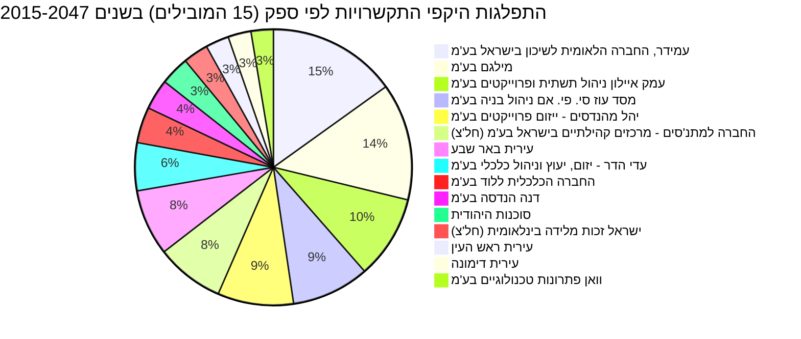
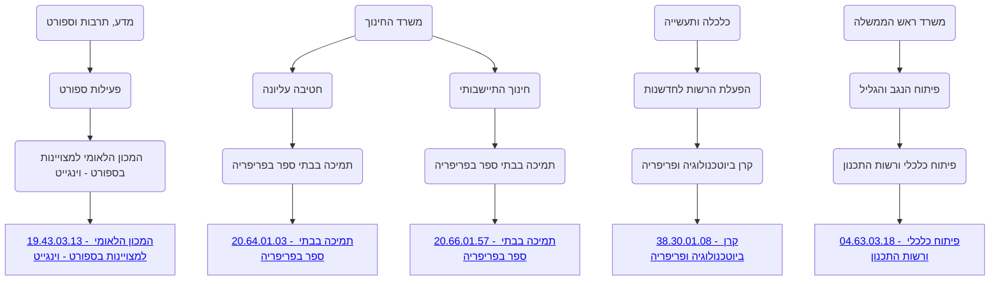

# נתוני תקציב, התקשרויות והחלטות ממשלה בתחום מצוינות בפריפריה

דוח זה סוקר את ההקצאות התקציביות, ההתקשרויות הממשלתיות והחלטות הממשלה הקשורות לנושא 'מצוינות בפריפריה'. אנו רואים מגמה של השקעה משמעותית בתחום לאורך השנים, עם דגש על פיתוח כלכלי, חינוך, ספורט וחדשנות באזורי הפריפריה. משרד ראש הממשלה ומשרד החינוך הם השחקנים המרכזיים בתקציבים אלו. ניתן למצוא מידע נוסף על פעילות הממשלה באתר הבא: [משרד ראש הממשלה](https://next.obudget.org/i/04).

## מגמה תקציבית לאורך זמן

התקציב המדינתי הכולל לשנים 1997-2026 מוצג להלן (הסכומים בש"ח):

| Year | Allocated (₪) | Revised (₪) | Used (₪) |
|---|---|---|---|
| 1997 | 154,219,147,000 | 160,929,198,000 | 148,047,380,357 |
| 1998 | 165,767,617,000 | 173,934,768,000 | 159,847,075,076 |
| 1999 | 175,134,294,000 | 183,710,091,000 | 170,831,625,357 |
| 2000 | 184,522,220,000 | 195,461,335,000 | 180,458,014,989 |
| 2001 | 193,470,867,000 | 205,170,448,000 | 192,128,700,360 |
| 2002 | 205,114,690,000 | 217,010,311,000 | 202,026,431,968 |
| 2003 | 212,951,459,000 | 226,091,379,000 | 205,392,720,683 |
| 2004 | 210,756,382,000 | 223,624,684,000 | 202,878,472,348 |
| 2005 | 215,522,329,000 | 230,652,129,000 | 209,211,654,845 |
| 2006 | 219,007,015,000 | 235,327,760,000 | 219,462,848,295 |
| 2007 | 230,001,059,000 | 245,497,133,000 | 226,752,708,582 |
| 2008 | 235,667,815,000 | 253,017,334,000 | 233,587,464,213 |
| 2009 | 248,210,346,000 | 267,351,184,000 | 246,620,545,572 |
| 2010 | 256,042,959,000 | 276,735,839,000 | 253,994,800,333 |
| 2011 | 271,196,234,000 | 292,512,949,000 | 268,040,635,450 |
| 2012 | 284,657,172,000 | 307,622,112,000 | 288,313,136,323 |
| 2013 | 309,543,947,000 | 327,742,968,000 | 304,895,876,012 |
| 2014 | 315,961,958,000 | 338,855,694,000 | 314,127,850,809 |
| 2015 | 329,533,344,000 | 353,788,270,000 | 325,921,286,230 |
| 2016 | 347,689,079,000 | 374,238,112,000 | 346,684,755,291 |
| 2017 | 359,719,453,000 | 385,315,437,000 | 360,044,254,453 |
| 2018 | 376,720,622,000 | 402,537,069,000 | 378,657,824,851 |
| 2019 | 397,431,127,000 | 421,486,031,000 | 400,475,676,299 |
| 2020 | null | 516,369,022,000 | 479,419,815,771 |
| 2021 | 500,513,603,000 | 520,876,171,000 | 482,239,292,852 |
| 2022 | 462,500,134,000 | 501,125,218,000 | 459,007,881,415 |
| 2023 | 484,784,569,000 | 548,230,059,000 | 515,939,024,478 |
| 2024 | 584,097,733,000 | 652,962,743,000 | 620,012,102,474 |
| 2025 | 619,579,848,000 | 682,799,662,000 | 650,530,467,596 |
| 2026 | 698,780,078,000 | 709,395,841,000 | null |

## תכניות פעילות כיום

### התפלגות היקפי התקשרויות לפי ספק (15 הספקים המובילים) בשנים 2015-2047

## מקורות תקציב

התקציבים המיועדים למצוינות בפריפריה מתפרסים על פני מגוון רחב של משרדי ממשלה וסעיפים תקציביים. התרשים הבא מציג את ההיררכיה התקציבית עבור השנים 2025-2026, ומתמקד בסעיפים בעלי הקצאה של 50 מיליון ש"ח ומעלה, תוך הדגשת הפיזור בין משרד ראש הממשלה, משרד החינוך, משרד המדע, התרבות והספורט, ומשרד הכלכלה והתעשייה. זוהי תמונה מרוכזת של סעיפי המאקרו והמיקרו הרלוונטיים, המסייעת להבין את המבנה וההיקף של ההשקעה הממשלתית בתחומים אלו.

### רשימת סעיפי תקציב נבחרים (עם קישורים)
*   [04 - משרד ראש הממשלה](https://next.obudget.org/i/04)
    *   [04.63 - פיתוח הנגב והגליל](https://next.obudget.org/i/0463)
        *   [04.63.03 - פיתוח כלכלי ורשות התכנון](https://next.obudget.org/i/046303)
            *   [04.63.03.18 - פיתוח כלכלי ורשות התכנון](https://next.obudget.org/i/8509b722c69c)
*   [19 - מדע, תרבות וספורט](https://next.obudget.org/i/19)
    *   [19.43 - פעילות ספורט](https://next.obudget.org/i/1943)
        *   [19.43.03 - המכון הלאומי למצויינות בספורט - וינגייט](https://next.obudget.org/i/194303)
            *   [19.43.03.13 - המכון הלאומי למצויינות בספורט - וינגייט](https://next.obudget.org/i/a8933326c638)
*   [20 - משרד החינוך](https://next.obudget.org/i/20)
    *   [20.64 - חטיבה עליונה](https://next.obudget.org/i/2064)
        *   [20.64.01 - תמיכה בבתי ספר בפריפריה](https://next.obudget.org/i/206401)
            *   [20.64.01.03 - תמיכה בבתי ספר בפריפריה](https://next.obudget.org/i/411bad1d7f19)
    *   [20.66 - חינוך התיישבותי](https://next.obudget.org/i/2066)
        *   [20.66.01 - תמיכה בבתי ספר בפריפריה](https://next.obudget.org/i/206601)
            *   [20.66.01.57 - תמיכה בבתי ספר בפריפריה](https://next.obudget.org/i/c1ab24a4c8e0)
*   [38 - כלכלה ותעשייה](https://next.obudget.org/i/38)
    *   [38.30 - הפעלת הרשות לחדשנות](https://next.obudget.org/i/3830)
        *   [38.30.01 - קרן ביוטכנולוגיה ופריפריה](https://next.obudget.org/i/383001)
            *   [38.30.01.08 - קרן ביוטכנולוגיה ופריפריה](https://next.obudget.org/i/550d58164219)

## נושאים נוספים

### התקשרויות/חוזים
להלן 50 ההתקשרויות הגדולות ביותר הקשורות לנושא:

| Purpose | Purchasing Ministry | Supplier Entity Name | Volume (₪) | Executed (₪) | Start Year | End Year | Item URL |
|---|---|---|---|---|---|---|---|
| רכישת דירות למלאי | משרד הבינוי והשיכון | עמידר, החברה הלאומית לשיכון בישראל בע״מ | 1,824,190,654.00 | 0.00 | 2018 | 2025 | [קישור](https://next.obudget.org/i/b76e42a7edb5) |
| עמלות ניהול | משרד הבינוי והשיכון | עמידר, החברה הלאומית לשיכון בישראל בע״מ | 1,725,182,451.93 | 0.00 | 2024 | 2030 | [קישור](https://next.obudget.org/i/46a3ab33e0a9) |
| איגוח עמידר | משרד הבינוי והשיכון | עמידר, החברה הלאומית לשיכון בישראל בע״מ | 1,000,000,000.00 | 0.00 | 2017 | 2028 | [קישור](https://next.obudget.org/i/cf9083e0d11f) |
| עמלות ניהול עמידר חדש | משרד הבינוי והשיכון | עמידר, החברה הלאומית לשיכון בישראל בע״מ | 914,479,640.10 | 0.00 | 2017 | 2024 | [קישור](https://next.obudget.org/i/89b8d7f50b1a) |
| אכלוס 1500 יח"ד גיל זהב | משרד הבינוי והשיכון | סוכנות היהודית | 794,880,000.00 | 0.00 | 2023 | 2047 | [קישור](https://next.obudget.org/i/bc6099e5d284) |
| פרוייקט תגלית | משרד ראש הממשלה | ישראל זכות מלידה בינלאומית (חל״צ) | 780,000,000.00 | 145,288,759.00 | 2017 | 2022 | [קישור](https://next.obudget.org/i/45afc88687ca) |
| פרוייקט תגלית | משרד ראש הממשלה | ישראל זכות מלידה בינלאומית (חל״צ) | 760,000,000.00 | 0.00 | 2017 | 2022 | [קישור](https://next.obudget.org/i/b4ab8ae2d627) |
| 1234 | משרד הבינוי והשיכון | מטרופוליס יזום השקעות ונכסים (1993) בע״מ | 738,892,463.00 | 0.00 | 2015 | 2022 | [קישור](https://next.obudget.org/i/72b660860b17) |
| מ.7/7.2020 -מתן שירותים מנהליים להפעלת תוכנית הזנה יוח"א תשפ"ד | משרד החינוך | מילגם בע״מ | 654,547,036.04 | 0.00 | 2023 | 2024 | [קישור](https://next.obudget.org/i/f7ad9dcd69ca) |
| מכרז היקפים משתנים מס' 7/7.2013 הזנה עפ"י חוק תשע"ט | משרד החינוך | מילגם בע״מ | 636,158,446.56 | 84,131,242.65 | 2018 | 2019 | [קישור](https://next.obudget.org/i/35da620f6924) |
| מ.7/7.2020 - מתן שירותים מנהליים להפעלת תוכנית הזנה ניצנים תשפד | משרד החינוך | מילגם בע״מ | 625,220,980.61 | 0.00 | 2023 | 2024 | [קישור](https://next.obudget.org/i/f9fa7ac3fb3a) |
| איגוח עמידר | משרד הבינוי והשיכון | עמידר, החברה הלאומית לשיכון בישראל בע״מ | 600,000,000.00 | 600,000,000.00 | 2017 | 2028 | [קישור](https://next.obudget.org/i/7171a2e9336e) |
| מיזם משותף עם סאסא סטון בתכנית קו אור- הפעלת תכניות ללמידה מרחוק ללידים חולים בבתי חולים ר | משרד החינוך | סאסא סטון בע״מ (חל״צ) | 591,366,980.50 | 1,092,639.75 | 2019 | 2019 | [קישור](https://next.obudget.org/i/0e9da37fd2dd) |
| תשלום שכ"ד עבור לימור אשקלון | משרד הבינוי והשיכון | החברה למימון פרויקט הדיור הציבורי של הסוכנות היהודית בע״מ | 553,320,000.00 | 0.00 | 2021 | 2041 | [קישור](https://next.obudget.org/i/cd9cd770cb15) |
| תשתיות על / ראש שטח | משרד הבינוי והשיכון | עירית באר שבע | 546,917,097.00 | 0.00 | 2015 | 2027 | [קישור](https://next.obudget.org/i/3d98f7bf1b96) |
| חברת בת של הסוכנות - החברה למימון פרוייקט הדיור הציבורי של הסוכנות היה | משרד הבינוי והשיכון | החברה למימון פרויקט הדיור הציבורי של הסוכנות היהודית בע״מ | 514,901,619.00 | 0.00 | 2018 | 2034 | [קישור](https://next.obudget.org/i/acb6ab2e32c5) |
| 1234 | משרד הבינוי והשיכון | סוכנות היהודית | 436,279,700.00 | 15,098,381.00 | 2015 | 2034 | [קישור](https://next.obudget.org/i/8bb945a5617f) |
| מ7/7.2020 מתן שירותיים מנהלתיים להפעלת תוכנית הזנה ואורח חיים בריא - הזנה בניצנים תשפה | משרד החינוך | מילגם בע״מ | 409,961,432.74 | 0.00 | 2024 | 2025 | [קישור](https://next.obudget.org/i/e700c3524f81) |
| פיתוח ל-121 יח"ד - שלב א (מתחם 1-א) | משרד הבינוי והשיכון | עירית באר שבע | 377,026,248.90 | 0.00 | 2022 | 2026 | [קישור](https://next.obudget.org/i/f2c9bee4653d) |
| מ. 7/7.2013 הזנה בניצנים שנה"ל תשע"ט | משרד החינוך | מילגם בע״מ | 375,801,291.45 | 0.00 | 2018 | 2019 | [קישור](https://next.obudget.org/i/574196f636ad) |
| מ. 7/7.2020 מתן שירותים מינהלתיים להפעלת תכנית הזנה ואורח חיים בריא - הזנה ביוחא תשפה | משרד החינוך | מילגם בע״מ | 375,152,369.66 | 0.00 | 2024 | 2025 | [קישור](https://next.obudget.org/i/e6ffafafb4cf) |
| בניית 1,500 יח"ד גיל זהב | משרד הבינוי והשיכון | סוכנות היהודית | 354,750,000.00 | 0.00 | 2023 | 2042 | [קישור](https://next.obudget.org/i/570f4b82b2c3) |
| מכרז היקפים משתנים מס' 7/7.2013 הזנה בניצנים תש"ף | משרד החינוך | מילגם בע״מ | 351,391,340.80 | 0.00 | 2019 | 2020 | [קישור](https://next.obudget.org/i/a55ad5a694d1) |
| מ. 7/7.2020 - מתן שירותים מינהליים להפעלת תכנית הזנה ואורח חיים בריא - הזנה ביוח"א | משרד החינוך | מילגם בע״מ | 341,503,159.26 | 0.00 | 2022 | 2023 | [קישור](https://next.obudget.org/i/4a88baa35bfb) |
| מכרז היקפים משתנים מס' 7/7.2013 הזנה עפ"י חוק תש"ף | משרד החינוך | מילגם בע״מ | 338,007,389.78 | 0.00 | 2019 | 2020 | [קישור](https://next.obudget.org/i/3c2599d93bae) |
| מ. 7/7.2013 הזנה עפ"י חוק שנה"ל תשע"ט | משרד החינוך | מילגם בע״מ | 336,158,447.04 | 0.00 | 2018 | 2019 | [קישור](https://next.obudget.org/i/c4999c53257b) |
| תשלום שכ"ד עבור לימור אשקלון | משרד הבינוי והשיכון | החברה למימון פרויקט הדיור הציבורי של הסוכנות היהודית בע״מ | 328,680,000.00 | 11,216,352.00 | 2021 | 2041 | [קישור](https://next.obudget.org/i/c79e3246c116) |
| מ. 7/7.2020 - מתן שירותים מינהליים להפעלת תכנית הזנה ואורח חיים בריא - הזנה בניצנים | משרד החינוך | מילגם בע״מ | 326,741,484.34 | 0.00 | 2022 | 2023 | [קישור](https://next.obudget.org/i/7352da00f772) |
| מכרז מס' 7/7.2013 הזנה עפ"י חוק תשע"ח | משרד החינוך | מילגם בע״מ | 324,958,708.48 | 0.00 | 2017 | 2018 | [קישור](https://next.obudget.org/i/58efbb915232) |
| מכרז מס' 7/7.2013 הזנה עפ"י חוק תשע"ח | משרד החינוך | מילגם בע״מ | 322,204,821.12 | 316,284,907.77 | 2017 | 2018 | [קישור](https://next.obudget.org/i/a5739a678f93) |
| רכישת דירות למלאי | משרד הבינוי והשיכון | עמידר, החברה הלאומית לשיכון בישראל בע״מ | 303,473,888.00 | 303,474,034.00 | 2018 | 2023 | [קישור](https://next.obudget.org/i/d4ebc975f5ac) |
| פטור ממכרז-ספק יחיד מתן שירותים מינהליים להפעלת תוכנית הזנה בתוכנית הצהרונים הלאומית ניצני | משרד החינוך | מילגם בע״מ | 289,040,656.45 | 0.00 | 2022 | 2022 | [קישור](https://next.obudget.org/i/7ef31ae35da0) |
| קו עציונה | משרד הבינוי והשיכון | מי שמש בע״מ | 286,393,720.01 | 0.00 | 2022 | 2026 | [קישור](https://next.obudget.org/i/55cad161203c) |
| מכרז מס' 7/7.2013- הזנה עפ"י חוק תשע"ז | משרד החינוך | מילגם בע״מ | 284,874,735.60 | 277,778,475.00 | 2016 | 2017 | [קישור](https://next.obudget.org/i/1f7f8dc7b53b) |
| מכרז מס' 7/7.2013- הזנה עפ"י חוק תשע"ז | משרד החינוך | מילגם בע״מ | 284,874,735.60 | 277,778,475.00 | 2016 | 2017 | [קישור](https://next.obudget.org/i/7deed16f1fbf) |
| פטור ממכרז-ספק יחיד מתן שירותים מינהליים להפעלת תוכנית הזנה בתוכנית יוח"א (יום לימודים ארו | משרד החינוך | מילגם בע״מ | 283,952,913.27 | 0.00 | 2022 | 2022 | [קישור](https://next.obudget.org/i/e9cebba3c282) |
| פיתוח ל-121 יח"ד - שלב א (מתחם 1-א) | משרד הבינוי והשיכון | עירית באר שבע | 260,000,000.00 | 0.00 | 2022 | 2025 | [קישור](https://next.obudget.org/i/ce899a4f2a70) |
| הזנה עפ"י חוק תשע"ו | משרד החינוך | מילגם בע״מ | 257,147,634.51 | 255,197,163.82 | 2015 | 2016 | [קישור](https://next.obudget.org/i/08cd8b7efb31) |
| הזנה עפ"י חוק תשע"ו | משרד החינוך | מילגם בע״מ | 257,147,634.51 | 255,197,163.82 | 2015 | 2016 | [קישור](https://next.obudget.org/i/406511be1f5c) |
| מכרז מס' 7/7.2013 הזנה בניצנים שנה"ל תשפ"א - מילגם | משרד החינוך | מילגם בע״מ | 253,044,214.75 | 0.00 | 2020 | 2021 | [קישור](https://next.obudget.org/i/77416f199a14) |
| עמלות ניהול עמיגור להסכם חדש ל - 7 שנים | משרד הבינוי והשיכון | עמי גור ניהול נכסים בעמ | 252,373,575.72 | 0.00 | 2019 | 2026 | [קישור](https://next.obudget.org/i/505484b9c8ea) |
| עמלות ניהול עמיגור להסכם חדש ל - 7 שנים | משרד הבינוי והשיכון | עמי גור ניהול נכסים בעמ | 252,373,575.72 | 97,353,212.86 | 2019 | 2026 | [קישור](https://next.obudget.org/i/811aade3113d) |
| מכרז 14/4.2014 הסכם תוכנית קרב הפעלה לשנת תשעט | משרד החינוך | החברה למתנ״סים - מרכזים קהילתיים בישראל בע״מ (חל״צ) | 244,760,148.00 | 232,853,524.31 | 2018 | 2019 | [קישור](https://next.obudget.org/i/12cdee8bc2f7) |
| תשתיות על / ראש שטח | משרד הבינוי והשיכון | עירית באר שבע | 235,332,439.00 | 235,328,878.53 | 2015 | 2026 | [קישור](https://next.obudget.org/i/d300331a3771) |
| מ. 16/6.2024 הפעלה וניהול מערך הסעות תלמידי הפזורה הבדואית בנגב שנה"ל תשפ"ה | משרד החינוך | אם גרופ בע״מ | 226,653,505.87 | 0.00 | 2024 | 2025 | [קישור](https://next.obudget.org/i/f3585dbdc5bf) |
| בהתאם להסכם הישן | משרד הבינוי והשיכון | עמידר, החברה הלאומית לשיכון בישראל בע״מ | 210,707,548.32 | 0.00 | 2015 | 2024 | [קישור](https://next.obudget.org/i/38ed0c95aea9) |
| קדם מימון לביצוע עבודות ומערכות תת"ק-שלב א התמם ה1.. | משרד הבינוי והשיכון | מסד עוז סי. פי. אם ניהול בניה בע״מ | 204,977,570.44 | 142,525,411.78 | 2015 | 2020 | [קישור](https://next.obudget.org/i/a5e01ad16e20) |
| קדם מימון לביצוע עבודות ומערכות תת"ק-שלב א התמם ה1.. | משרד הבינוי והשיכון | מסד עוז סי. פי. אם ניהול בניה בע״מ | 204,977,570.44 | 167,652,345.62 | 2015 | 2025 | [קישור](https://next.obudget.org/i/0db2e7b1f0ab) |
| עבור רכש דירות | משרד הבינוי והשיכון | עמידר, החברה הלאומית לשיכון בישראל בע״מ | 199,999,999.95 | 0.00 | 2024 | 2030 | [קישור](https://next.obudget.org/i/c14eb2951d59) |
| הפעלת מתנ"סים ברחבי הארץ | משרד החינוך | החברה למתנ״סים - מרכזים קהילתיים בישראל בע״מ (חל״צ) | 197,751,803.55 | 147,748,871.84 | 2015 | 2016 | [קישור](https://next.obudget.org/i/ed37d2fd8c58) |

### ספקים
להלן סך ההתקשרויות המקובצות לפי ספק:

| Supplier Entity Name | Supplier Entity ID | Supplier Entity Kind | Total Volume (₪) | Supplier Page |
|---|---|---|---|---|
| [עמידר, החברה הלאומית לשיכון בישראל בע״מ](https://next.obudget.org/i/org/company/520017393) | 520017393 | company | 9,519,433,295.62 | [קישור](https://next.obudget.org/i/org/company/520017393) |
| [מילגם בע״מ](https://next.obudget.org/i/org/company/510982325) | 510982325 | company | 8,670,002,585.77 | [קישור](https://next.obudget.org/i/org/company/510982325) |
| [עמק איילון ניהול תשתית ופרוייקטים בע״מ](https://next.obudget.org/i/org/company/511925109) | 511925109 | company | 6,170,642,366.48 | [קישור](https://next.obudget.org/i/org/company/511925109) |
| [מסד עוז סי. פי. אם ניהול בניה בע״מ](https://next.obudget.org/i/org/company/511535940) | 511535940 | company | 5,739,964,674.75 | [קישור](https://next.obudget.org/i/org/company/511535940) |
| [יהל מהנדסים - ייזום פרוייקטים בע״מ](https://next.obudget.org/i/org/company/511776247) | 511776247 | company | 5,599,148,822.45 | [קישור](https://next.obudget.org/i/org/company/511776247) |
| [החברה למתנ״סים - מרכזים קהילתיים בישראל בע״מ (חל״צ)](https://next.obudget.org/i/org/association/510525348) | 510525348 | association | 5,035,118,437.56 | [קישור](https://next.obudget.org/i/org/association/510525348) |
| [עירית באר שבע](https://next.obudget.org/i/org/municipality/500290002) | 500290002 | municipality | 4,896,590,728.13 | [קישור](https://next.obudget.org/i/org/municipality/500290002) |
| [עדי הדר - יזום, יעוץ וניהול כלכלי בע״מ](https://next.obudget.org/i/org/company/512546011) | 512546011 | company | 3,544,783,138.53 | [קישור](https://next.obudget.org/i/org/company/512546011) |
| [החברה הכלכלית ללוד בע״מ](https://next.obudget.org/i/org/company/511584633) | 511584633 | company | 2,652,805,817.48 | [קישור](https://next.obudget.org/i/org/company/511584633) |
| [דנה הנדסה בע״מ](https://next.obudget.org/i/org/company/511945099) | 511945099 | company | 2,249,744,494.34 | [קישור](https://next.obudget.org/i/org/company/511945099) |
| [סוכנות היהודית](https://next.obudget.org/i/org/law_mandated_organization/500500046) | 500500046 | law_mandated_organization | 2,142,800,483.03 | [קישור](https://next.obudget.org/i/org/law_mandated_organization/500500046) |
| [ישראל זכות מלידה בינלאומית (חל״צ)](https://next.obudget.org/i/org/association/512764366) | 512764366 | association | 1,858,529,847.00 | [קישור](https://next.obudget.org/i/org/association/512764366) |
| [עירית ראש העין](https://next.obudget.org/i/org/municipality/500226402) | 500226402 | municipality | 1,723,136,203.54 | [קישור](https://next.obudget.org/i/org/municipality/500226402) |
| [עירית דימונה](https://next.obudget.org/i/org/municipality/500222005) | 500222005 | municipality | 1,700,344,154.54 | [קישור](https://next.obudget.org/i/org/municipality/500222005) |
| [וואן פתרונות טכנולוגיים בע״מ](https://next.obudget.org/i/org/company/520039710) | 520039710 | company | 1,645,613,646.16 | [קישור](https://next.obudget.org/i/org/company/520039710) |
| [ערים חברה לפתוח עירוני בעמ](https://next.obudget.org/i/org/company/520029810) | 520029810 | company | 1,644,379,316.87 | [קישור](https://next.obudget.org/i/org/company/520029810) |
| [החברה למימון פרויקט הדיור הציבורי של הסוכנות היהודית בע״מ](https://next.obudget.org/i/org/company/515527109) | 515527109 | company | 1,598,569,263.00 | [קישור](https://next.obudget.org/i/org/company/515527109) |
| [מסע: פרויקט לעידוד תוכניות ארוכות בישראל לצעירי העם היהודי בע״מ (חל״צ)](https://next.obudget.org/i/org/association/513569210) | 513569210 | association | 1,470,214,796.00 | [קישור](https://next.obudget.org/i/org/association/513569210) |
| [גדיש חברה להנדסה בע״מ](https://next.obudget.org/i/org/company/510812118) | 510812118 | company | 1,422,854,286.84 | [קישור](https://next.obudget.org/i/org/company/510812118) |
| [עירית שדרות](https://next.obudget.org/i/org/municipality/500210315) | 500210315 | municipality | 1,370,340,876.08 | [קישור](https://next.obudget.org/i/org/municipality/500210315) |
| [א. יתד מהנדסים ניהול פיקוח וייזום פרויקטים בע״מ](https://next.obudget.org/i/org/company/515526184) | 515526184 | company | 1,096,517,887.46 | [קישור](https://next.obudget.org/i/org/company/515526184) |
| [עמי גור ניהול נכסים בעמ](https://next.obudget.org/i/org/company/510531874) | 510531874 | company | 1,081,837,113.46 | [קישור](https://next.obudget.org/i/org/company/510531874) |
| [מי שמש בע״מ](https://next.obudget.org/i/org/company/514425651) | 514425651 | company | 959,218,753.24 | [קישור](https://next.obudget.org/i/org/company/514425651) |
| [מטרופוליס יזום השקעות ונכסים (1993) בע״מ](https://next.obudget.org/i/org/company/511870982) | 511870982 | company | 940,465,336.94 | [קישור](https://next.obudget.org/i/org/company/511870982) |
| [מרמנת אירגון וניהול פרויקטים בע״מ](https://next.obudget.org/i/org/company/512027129) | 512027129 | company | 940,395,311.23 | [קישור](https://next.obudget.org/i/org/company/512027129) |
| [עירית טירת כרמל](https://next.obudget.org/i/org/municipality/500221007) | 500221007 | municipality | 820,045,171.72 | [קישור](https://next.obudget.org/i/org/municipality/500221007) |
| [דירה להשכיר - החברה הממשלתית לדיור ולהשכרה בע״מ](https://next.obudget.org/i/org/company/515009652) | 515009652 | company | 795,769,767.20 | [קישור](https://next.obudget.org/i/org/company/515009652) |
| [מטריקס אי. טי. מערכות מידע מתקדמות בע״מ](https://next.obudget.org/i/org/company/511171662) | 511171662 | company | 795,021,298.80 | [קישור](https://next.obudget.org/i/org/company/511171662) |
| [עירית אשדוד](https://next.obudget.org/i/org/municipality/500200704) | 500200704 | municipality | 750,293,651.65 | [קישור](https://next.obudget.org/i/org/municipality/500200704) |
| [אקסיומה - הישגים בהשכלה בע״מ](https://next.obudget.org/i/org/company/512693987) | 512693987 | company | 748,125,949.18 | [קישור](https://next.obudget.org/i/org/company/512693987) |
| [ברן ישראל בע״מ](https://next.obudget.org/i/org/company/510801657) | 510801657 | company | 720,371,834.89 | [קישור](https://next.obudget.org/i/org/company/510801657) |
| [עירית בית-שמש](https://next.obudget.org/i/org/municipality/500226105) | 500226105 | municipality | 698,511,418.36 | [קישור](https://next.obudget.org/i/org/municipality/500226105) |
| [עיריית חריש](https://next.obudget.org/i/org/municipality/500212477) | 500212477 | municipality | 688,358,773.11 | [קישור](https://next.obudget.org/i/org/municipality/500212477) |
| [עירית ירושלים](https://next.obudget.org/i/org/municipality/500230008) | 500230008 | municipality | 687,301,847.58 | [קישור](https://next.obudget.org/i/org/municipality/500230008) |
| [המרכז לטכנולוגיה חינוכית (חל״צ)](https://next.obudget.org/i/org/association/510557705) | 510557705 | association | 673,223,406.73 | [קישור](https://next.obudget.org/i/org/association/510557705) |
| [עירית עכו](https://next.obudget.org/i/org/municipality/500276001) | 500276001 | municipality | 609,016,388.66 | [קישור](https://next.obudget.org/i/org/municipality/500276001) |
| [סאסא סטון בע״מ (חל״צ)](https://next.obudget.org/i/org/association/514907815) | 514907815 | association | 602,535,784.50 | [קישור](https://next.obudget.org/i/org/association/514907815) |
| [מ. א. מטה בנימין](https://next.obudget.org/i/org/municipality/500274733) | 500274733 | municipality | 566,764,428.44 | [קישור](https://next.obudget.org/i/org/municipality/500274733) |
| [גוינט ישראל (חל״צ)](https://next.obudget.org/i/org/association/510681414) | 510681414 | association | 560,222,573.32 | [קישור](https://next.obudget.org/i/org/association/510681414) |
| [נס א.ט. בע״מ](https://next.obudget.org/i/org/company/520040122) | 520040122 | company | 549,920,618.77 | [קישור](https://next.obudget.org/i/org/company/520040122) |
| [האגודה לתרבות הדיור (ע"ר)](https://next.obudget.org/i/org/association/580016087) | 580016087 | association | 542,886,929.01 | [קישור](https://next.obudget.org/i/org/association/580016087) |
| [עתיד - רשת חינוך ובתי ספר בע״מ (חל״צ)](https://next.obudget.org/i/org/association/513532333) | 513532333 | association | 537,814,647.30 | [קישור](https://next.obudget.org/i/org/association/513532333) |
| [י.ת.ב. בע״מ](https://next.obudget.org/i/org/company/510599947) | 510599947 | company | 516,367,196.40 | [קישור](https://next.obudget.org/i/org/company/510599947) |
| [פמי פרימיום בע״מ](https://next.obudget.org/i/org/company/512676206) | 512676206 | company | 514,963,120.28 | [קישור](https://next.obudget.org/i/org/company/512676206) |
| [עירית נהריה](https://next.obudget.org/i/org/municipality/500291000) | 500291000 | municipality | 487,933,226.70 | [קישור](https://next.obudget.org/i/org/municipality/500291000) |

### החלטות ממשלה
להלן החלטות ממשלה רלוונטיות לנושא "מצוינות בפריפריה":

| title | government | decision_number | publication_date | item_url |
|---|---|---|---|---|
| האצת שוק העבודה באמצעות קידום ההון האנושי והתאמת המיומנויות לעידן הדיגיטלי | הממשלה ה- 37 | 172 | 2023-02-24 | [item_url](https://next.obudget.org/i/38946611184b) |
| תוכנית לאומית להגדלה ופיתוח הון אנושי מיומן לתעשיית ההייטק והחדשנות ושילוב קבוצות בייצוג חסר | הממשלה ה- 36, יאיר לפיד | 1852 | 2022-09-11 | [item_url](https://next.obudget.org/i/a733e5397e59) |
| תוכנית החומש "לביא" לפיתוחה הכלכלי של ירושלים | הממשלה ה- 36, נפתלי בנט | 1512 | 2022-05-29 | [item_url](https://next.obudget.org/i/4dd520d30494) |
| תכנית לפיתוח כלכלי חברתי בקרב האוכלוסייה הבדואית בנגב 2022 - 2026 ותיקון החלטות ממשלה | הממשלה ה- 36, נפתלי בנט | 1279 | 2022-03-14 | [item_url](https://next.obudget.org/i/438af0450488) |
| תכנית לעידוד צמיחה דמוגרפית בת קיימא ביישובי המועצה האזורית גולן וקצרין לשנים 2022 - 2025 | הממשלה ה- 36, נפתלי בנט | 864 | 2021-12-26 | [item_url](https://next.obudget.org/i/7606e92077a2) |
| תוכנית להעצמה ולפיתוח כלכלי-חברתי ביישובים הדרוזיים ברמת הגולן לשנים 2021 עד 2023 | הממשלה ה- 36, נפתלי בנט | 717 | 2021-11-28 | [item_url](https://next.obudget.org/i/ce8e81fceb7b) |
| תוכנית להעצמה ולפיתוח כלכלי חברתי ביישובים הדרוזיים והצ'רקסיים בגליל ובכרמל לשנים 2021 עד 2023 ותיקון החלטות ממשלה | הממשלה ה- 36, נפתלי בנט | 716 | 2021-11-28 | [item_url](https://next.obudget.org/i/628d5b37cbbb) |
| תכנית לפיתוח ולהעצמת היישובים הדרוזים והצ'רקסים לשנת 2020 ותיקון החלטת ממשלה | הממשלה ה- 34, בנימין נתניהו | 4798 | 2019-12-29 | [item_url](https://next.obudget.org/i/8a4789fa49be) |
| תכנית להעצמה ולחיזוק היישובים קריית שמונה, שלומי ומטולה | הממשלה ה- 34, בנימין נתניהו | 3740 | 2018-04-15 | [item_url](https://next.obudget.org/i/129bf0effc4b) |
| תוכנית רב-שנתית לחיזוק ירוחם | הממשלה ה- 34, בנימין נתניהו | 3741 | 2018-04-15 | [item_url](https://next.obudget.org/i/67861fe78b6e) |
| תכנית לפיתוח כלכלי חברתי בקרב האוכלוסייה הבדואית בנגב 2021-2017 | הממשלה ה- 34, בנימין נתניהו | 2397 | 2017-02-12 | [item_url](https://next.obudget.org/i/e06c99332653) |
| פיתוח כלכלי של מחוז הצפון וצעדים משלימים לעיר חיפה | הממשלה ה- 34, בנימין נתניהו | 2262 | 2017-01-08 | [item_url](https://next.obudget.org/i/7cf010b32ba4) |
| תכנית ממשלתית להעצמה ולחיזוק כלכלי-חברתי של היישובים הבדואים בצפון לשנים 2016 - 2020 | הממשלה ה- 34, בנימין נתניהו | 1480 | 2016-06-02 | [item_url](https://next.obudget.org/i/d88098180da2) |
| תכנית לפיתוח ולהעצמת היישובים הדרוזיים והצ'רקסיים לשנים 2016 - 2019 | הממשלה ה- 34, בנימין נתניהו | 959 | 2016-01-10 | [item_url](https://next.obudget.org/i/ab2d824a603a) |
| תכנית רב שנתית לפיתוח מצפה רמון | הממשלה ה- 34, בנימין נתניהו | 917 | 2015-12-31 | [item_url](https://next.obudget.org/i/b36189ceb6f1) |
| תכנית לפיתוח ולהעצמת היישובים הדרוזיים והצ'רקסיים לשנים 2016 - 2020 | None | 59 | 2015-06-07 | [item_url](https://next.obudget.org/i/13d2a3ea7a3f) |

## מקורות
*   **סעיפי תקציב:**
    *   [פיתוח כלכלי ורשות התכנון](https://next.obudget.org/i/8509b722c69c)
    *   [תמיכה בבתי ספר בפריפריה (חטיבה עליונה)](https://next.obudget.org/i/411bad1d7f19)
    *   [המכון הלאומי למצויינות בספורט - וינגייט](https://next.obudget.org/i/a8933326c638)
    *   [תמיכה בבתי ספר בפריפריה (חינוך התיישבותי)](https://next.obudget.org/i/c1ab24a4c8e0)
    *   [קרן ביוטכנולוגיה ופריפריה](https://next.obudget.org/i/550d58164219)
    *   [פעולות להאצת ענף הנדל"ן וקידום השיווקים בפריפריה](https://next.obudget.org/i/1544be644bdb)
    *   [פרויקט עתידים לעידוד תלמידים מצטיינים בפריפריה](https://next.obudget.org/i/210d20d9df82)
    *   [תעסוקה בפריפריה המרוחקת](https://next.obudget.org/i/dbd10284d789)
    *   [פרויקט התנדבות בפריפריה בחטיבה העליונה](https://next.obudget.org/i/5f6fcb9f9c28)
    *   [פריפריה חברתית](https://next.obudget.org/i/1e76aa19eff7)
    *   [פעולות המרכז למצוינות (קשור, לא נכלל בסכומים)](https://next.obudget.org/i/482711950f70)

*   **התקשרויות (דוגמאות):**
    *   [רכישת דירות למלאי](https://next.obudget.org/i/b76e42a7edb5)
    *   [פרוייקט תגלית](https://next.obudget.org/i/45afc88687ca)
    *   [מתן שירותים מנהליים להפעלת תוכנית הזנה יוח"א תשפ"ד](https://next.obudget.org/i/f7ad9dcd69ca)

*   **החלטות ממשלה:**
    *   [האצת שוק העבודה באמצעות קידום ההון האנושי והתאמת המיומנויות לעידן הדיגיטלי](https://next.obudget.org/i/38946611184b)
    *   [תוכנית לאומית להגדלה ופיתוח הון אנושי מיומן לתעשיית ההייטק והחדשנות ושילוב קבוצות בייצוג חסר](https://next.obudget.org/i/a733e5397e59)
    *   [תכנית לפיתוח כלכלי חברתי בקרב האוכלוסייה הבדואית בנגב 2022 - 2026 ותיקון החלטות ממשלה](https://next.obudget.org/i/438af0450488)

[חזרה לעמוד הראשי](../../README.md)

<!-- orchestrator:related-reports:start -->

## דוחות קשורים

- [נתוני תקציב, התקשרויות והחלטות ממשלה בתחום מרכזי מצוינות](../excellence-center/excellence-center.md)

<!-- orchestrator:related-reports:end -->
