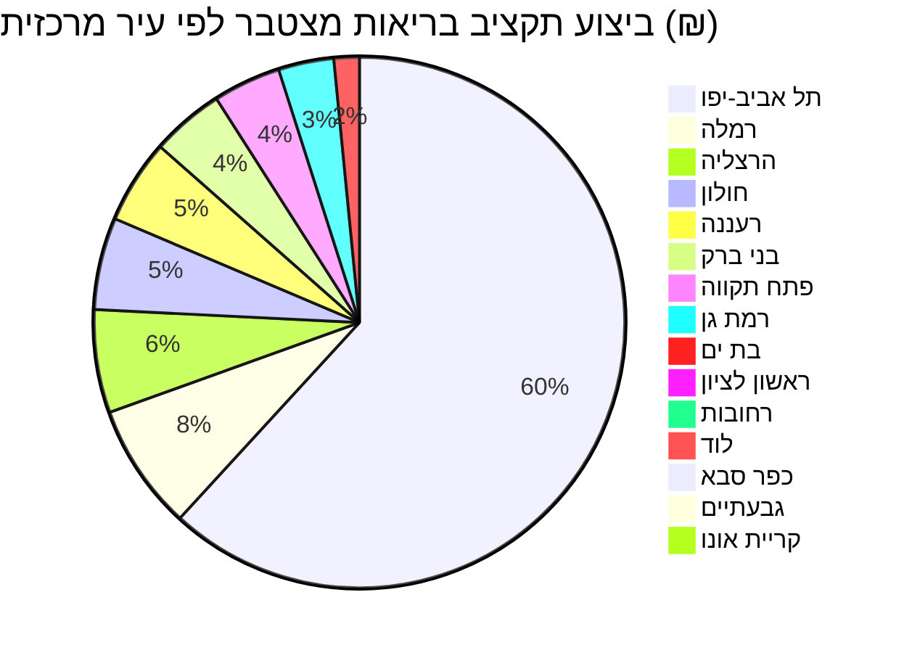

## סיכום ומתודולוגיה

דוח זה מפרק את ביצוע תקציב **משרד הבריאות** (סעיף `24`, ראו את דוח השער
[תקציב הבריאות הארצי](./general.md)) לפי ערים מרכזיות, על בסיס נתוני
**התקשרויות רכש** (`contracts_data`) ו**תמיכות תקציביות** (`supports_transactions_data`)
שביצועם/ספקם/מקבלם רשום תחת שם הכולל את שם אחת מהערים הבאות:

> **רשימת "ערים במרכז" (CENTER_CITIES)**: תל אביב-יפו, רמת גן, גבעתיים,
> בני ברק, פתח תקווה, ראשון לציון, חולון, בת ים, הרצליה, כפר סבא, רעננה,
> רחובות, לוד, רמלה, קריית אונו.

**⚠️ הבהרה מתודולוגית חשובה:** במאגרי הנתונים של מפתח התקציב **אין** שדה
מובנה של "מרכז מול פריפריה". הרשימה לעיל היא רשימה קבועה שנבחרה מראש לצורך
דוח זה (ולא מדד רשמי של הלמ"ס), וההתאמה בוצעה על ידי חיפוש שם העיר בתוך שם
**הספק** (בהתקשרויות רכש) או **מקבל התמיכה** (בתמיכות תקציביות) — לא לפי
מדד פריפריאליות רשמי כלשהו. משמעות הדבר:

1. הנתונים כוללים **כל** ישות ששמה מכיל את שם העיר — לאו דווקא את העירייה
   עצמה. כך למשל בתי חולים, עמותות ותאגידים הרשומים/פועלים בעיר (כגון
   "תאגיד הבריאות ליד המרכז הרפואי תל-אביב") נספרים תחת אותה עיר, גם אם
   השירות שהם נותנים משרת אוכלוסייה ארצית ולא רק תושבי העיר.
2. **ביצוע "בתוך" העיר ≠ כלל ההוצאה הלאומית שמטיבה עם תושבי מרכז הארץ.**
   דוח זה תופס רק הוצאות שבוצעו/שולמו ישירות לישות הרשומה בעיר (למשל בית
   חולים, שירותי בריאות עירוניים, ספק מקומי) — לא, למשל, תשלומי קופות
   חולים ארציות עבור מבוטחים שמתגוררים באחת מהערים הללו.
3. דוח המשך על ביצוע תקציב הבריאות **ביישובי הפריפריה** מתוכנן להתפרסם
   בהמשך באותה תיקייה, ויאפשר להשוות בין שני חתכי הנתונים.

## חלון כיסוי

- **התקשרויות רכש** (`contracts_data`): הנתונים מכסים החל משנת **2015**
  ועד **2026** (חלק מההתקשרויות הפעילות כיום — `is_active = true` —
  ימשיכו להיות מבוצעות/מדווחות מעבר לשנה הנוכחית, כך שסכומי הביצוע לשנים
  2025–2026 עשויים עדיין להיות **חלקיים**).
- **תמיכות תקציביות** (`supports_transactions_data`): הנתונים מכסים החל
  משנת **2005** ועד **2025**.
- כל הסכומים בדוח זה הם **ביצוע בפועל / תשלום בפועל** (לא תקציב מתוכנן),
  ומצטברים לאורך כל חלון הכיסוי הרלוונטי לכל מאגר.

## התפלגות ביצוע תקציב הבריאות בין ערי המרכז (מצטבר, ₪)

הטבלה והתרשים הבאים מציגים את סך הביצוע (התקשרויות רכש + תמיכות ששולמו,
סעיף תקציבי `24.*`) עבור כל ישות ששמה תואם אחת מערי המרכז, מדורג מהגבוה
לנמוך:

| עיר | התקשרויות (ביצוע, ₪) | תמיכות (שולם, ₪) | סה"כ (₪) | % מסך ערי המרכז | מקור (דוגמה) |
| --- | ---: | ---: | ---: | ---: | :--- |
| תל אביב-יפו | 243,505,675 | 34,011,383 | **277,517,058** | 60.5% | [עירית תל-אביב-יפו](https://next.obudget.org/i/018cc6aed3eb) |
| רמלה | 28,990,800 | 5,522,095 | **34,512,895** | 7.5% | [עירית רמלה](https://next.obudget.org/i/09289ac73fc2) |
| הרצליה | 25,662,085 | 2,499,385 | **28,161,470** | 6.1% | [עירית הרצליה](https://next.obudget.org/i/339c8542366d) |
| חולון | 23,871,853 | 1,291,784 | **25,163,637** | 5.5% | [עירית חולון](https://next.obudget.org/i/02cad005fe09) |
| רעננה | 22,203,542 | 788,482 | **22,992,024** | 5.0% | [עירית רעננה](https://next.obudget.org/i/2e17f2b30b5f) |
| בני ברק | 8,259,249 | 11,669,473 | **19,928,722** | 4.3% | [עירית בני ברק](https://next.obudget.org/i/00e61e1617e3) |
| פתח תקווה | 17,009,600 | 1,516,221 | **18,525,821** | 4.0% | [עירית פתח תקוה](https://next.obudget.org/i/0e7d4e37cd26) |
| רמת גן | 7,531,414 | 7,619,441 | **15,150,855** | 3.3% | [עירית רמת גן](https://next.obudget.org/i/0543dad438e0) |
| בת ים | 3,202,424 | 3,752,640 | **6,955,064** | 1.5% | [עירית בת-ים](https://next.obudget.org/i/07974eae81b5) |
| ראשון לציון | 1,989,351 | 1,143,407 | **3,132,758** | 0.7% | [עירית ראשון לציון](https://next.obudget.org/i/1a4fc6bcf5ce) |
| רחובות | 2,034,754 | 406,760 | **2,441,514** | 0.5% | [עירית רחובות](https://next.obudget.org/i/2bb86583e8c8) |
| לוד | 411,836 | 1,891,834 | **2,303,670** | 0.5% | [עירית לוד](https://next.obudget.org/i/054ecac55cac) |
| כפר סבא | 57,315 | 1,354,685 | **1,412,000** | 0.3% | [עירית כפר סבא](https://next.obudget.org/i/300bf8c0963a) |
| גבעתיים | 153,457 | 218,296 | **371,753** | 0.08% | [עירית גבעתיים](https://next.obudget.org/i/c129dcbe978e) |
| קריית אונו | 0 | 158,911 | **158,911** | 0.03% | [עירית קרית אונו](https://next.obudget.org/i/13d01e7ab549) |
| **סה"כ (15 ערי מרכז)** | **384,883,354** | **73,844,798** | **458,728,152** | **100%** | — |

*הערכים בעמודות "התקשרויות" ו"תמיכות" הם ביצוע/תשלום מצטבר לאורך כל חלון
הכיסוי (2015–2026 להתקשרויות, 2005–2025 לתמיכות), ולא סכום שנתי. אין
נתונים "טרם בוצע" בטבלה זו — כל הסכומים משקפים ביצוע בפועל שכבר דווח;
עם זאת יש לקחת בחשבון שהתקשרויות פעילות (`is_active=true`) עשויות להוסיף
ביצוע נוסף בהמשך 2026 שטרם נכלל בנתונים.*

## חריגות בולטות: מי מסביר את הדומיננטיות של כל עיר

**תל אביב-יפו (60.5% מכלל ערי המרכז):** כ-90% מהסכום בעיר מקורו בשני
גופים בלבד — עיריית תל אביב-יפו עצמה (כ-136.6 מיליון ש"ח בין התקשרויות
לתמיכות) ו**תאגיד הבריאות ליד המרכז הרפואי תל-אביב** (בית החולים
איכילוב/סוראסקי, כ-112.5 מיליון ש"ח). כלומר הדומיננטיות של תל אביב
נובעת בעיקר מכך שבית חולים ממשלתי גדול (המשרת אוכלוסייה ארצית, לא רק
תושבי העיר) רשום בכתובת תל אביב — ולא מכך שתושבי העיר מקבלים חלק
אי-פרופורציונלי משירותי הבריאות. ([תאגיד הבריאות - איכילוב](https://next.obudget.org/i/06c090d41cd8))

**רמלה (מקום 2, 7.5%):** מונעת כמעט לחלוטין משני ספקים לא-עירוניים —
"א.ג שיקום בית לחיים רמלה בע״מ" (מוסד שיקום, כ-12.1 מיליון ש"ח) ו"החברה
לניהול קריית הממשלה רמלה בע״מ" (חברת ניהול מתחם משרדי ממשלה, כ-11.6
מיליון ש"ח) — כנראה תשתית משרדי משרד הבריאות/יחידות ממשלתיות במתחם קריית
הממשלה ברמלה, ולא שירותי בריאות לתושבי רמלה עצמם.
([קריית הממשלה רמלה](https://next.obudget.org/i/02110b263e1d))

**הרצליה (מקום 3, 6.1%):** מרבית הסכום (כ-20.9 מיליון ש"ח) מקורו ב"הרצליה
מדיקל סנטר בע״מ" — בית חולים פרטי — ולא בעירייה עצמה (שתרמה רק כ-0.36
מיליון ש"ח בהתקשרויות). ([הרצליה מדיקל סנטר](https://next.obudget.org/i/0e76901168e4))

**חולון (מקום 4, 5.5%):** מונע ברובו מ"קרן מחקרים רפואיים... ליד המרכז
הרפואי ע"ש א. וולפסון, חולון" (כ-21.7 מיליון ש"ח) — קרן המחקר של בית
החולים וולפסון — ולא מהעירייה. ([קרן וולפסון](https://next.obudget.org/i/01fee21ef74d))

**רעננה (מקום 5, 5.0%):** מונעת מ"א.ג. דיור רעננה בע״מ" (כ-21.6 מיליון
ש"ח) — חברת דיור מוגן/סיעודי — ולא מהעירייה עצמה (שתרמה כ-0.4 מיליון
ש"ח). ([א.ג. דיור רעננה](https://next.obudget.org/i/0f758d917240))

**לעומת זאת, בני ברק ורמת גן** הן שתי הערים היחידות ברשימה שבהן חלק
הארי של הסכום מגיע ישירות **מהעירייה עצמה** (תמיכות + התקשרויות עירוניות
בפועל) ולא מגורם חיצוני גדול — מה שמעיד על שירותי בריאות עירוניים פעילים
יחסית (מרפאות, מתנ"סים קהילתיים) בשתי הערים הללו.

**גבעתיים וקריית אונו** בתחתית הרשימה, עם ביצוע כמעט אפסי (0.08% ו-0.03%
בהתאמה) — ייתכן שנובע מכך שערים קטנות אלו נסמכות בעיקר על שירותי בריאות
של קופות החולים ולא על התקשרויות/תמיכות ישירות מול משרד הבריאות, ולכן
אינן מיוצגות היטב בשני המאגרים הללו.

## מקורות

- [סעיף התקציב 24 — משרד הבריאות (דוח השער)](https://next.obudget.org/i/613c4ef0295a)
- [עירית תל-אביב-יפו — התקשרויות תחת סעיף 24](https://next.obudget.org/i/018cc6aed3eb)
- [תאגיד הבריאות ליד המרכז הרפואי תל-אביב (איכילוב)](https://next.obudget.org/i/06c090d41cd8)
- [עירית רמלה — התקשרויות תחת סעיף 24](https://next.obudget.org/i/09289ac73fc2)
- [החברה לניהול קריית הממשלה רמלה בע״מ](https://next.obudget.org/i/02110b263e1d)
- [הרצליה מדיקל סנטר בע״מ](https://next.obudget.org/i/0e76901168e4)
- [קרן מחקרים רפואיים ליד המרכז הרפואי ע"ש א. וולפסון, חולון](https://next.obudget.org/i/01fee21ef74d)
- [א.ג. דיור רעננה בע״מ](https://next.obudget.org/i/0f758d917240)
- [עירית בני ברק — תמיכות תחת סעיף 24](https://next.obudget.org/i/2424afe63d15)
- [עירית רמת גן — תמיכות תחת סעיף 24](https://next.obudget.org/i/02fc4597a47b)
- [עירית קרית אונו — תמיכות תחת סעיף 24](https://next.obudget.org/i/13d01e7ab549)

## דוחות קשורים

חזרה לדוח השער: [תקציב הבריאות הארצי](./general.md).

דוח משלים על ביצוע תקציב הבריאות **ביישובי הפריפריה**, לפי אותה
מתודולוגיה, פורסם כעת: [תקציב בריאות בפריפריה](./periphery.md). ההשוואה
בין שני חתכי הנתונים מראה כי סך הביצוע המצטבר ב-23 יישובי הפריפריה
(₪569.18 מיליון) גבוה נומינלית בכ-24% מסך הביצוע ב-15 ערי המרכז (₪458.73
מיליון) — אך בממוצע לישוב בודד, ההוצאה נמוכה יותר בפריפריה (כ-₪24.75
מיליון) מאשר במרכז (כ-₪30.58 מיליון), כפי שמפורט בדוח הפריפריה.
