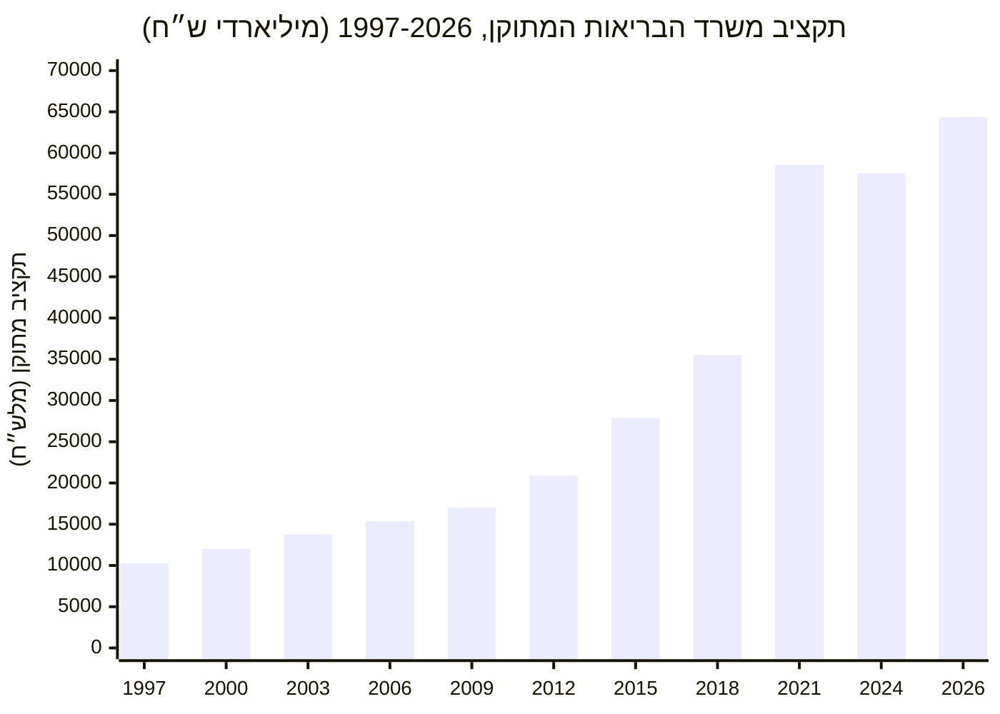
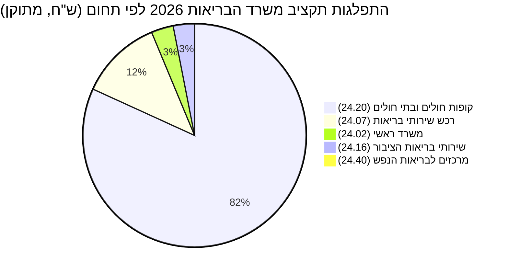

## סיכום

דוח זה הוא דוח השער (hub) של תחום הבריאות במאגר: הוא סוקר את תקציב **משרד
הבריאות** (סעיף תקציבי `24`) ברמה הארצית — מגמת התקציב הכוללת לאורך השנים,
התפלגות התקציב הנוכחי בין תחומי הפעילות המרכזיים של המשרד, וחריגות תקציביות
בולטות. הנתונים נשלפו בזמן אמת דרך כלי ה-MCP של
[מפתח התקציב](https://next.obudget.org/) ממאגר `budget_items_data`
(ספר התקציב הישראלי).

**חלון כיסוי:** הנתונים מכסים את השנים 1997–2026 (30 שנות תקציב רצופות).
נתוני **2026** הם תקציב מאושר בלבד — הביצוע בפועל **טרם בוצע** ויפורסם
במהלך/בתום שנת הכספים.

## מגמת התקציב הארצי לאורך השנים

הטבלה מציגה את תקציב משרד הבריאות (סעיף `24`, הכולל את כל תת-הסעיפים תחתיו)
לכל שנה: הסכום שאושר במקור, הסכום המתוקן לאחר שינויים תוך-שנתיים, והביצוע
בפועל.

| שנה  | תקציב מקורי (מלש"ח) | תקציב מתוקן (מלש"ח) | ביצוע בפועל (מלש"ח) | מקור |
| ---- | -------------------: | -------------------: | -------------------: | :--- |
| 1997 | 10,236 | 10,252 | 10,187 | [קישור](https://next.obudget.org/i/7ad0eef748ab) |
| 1998 | 11,649 | 11,833 | 11,762 | [קישור](https://next.obudget.org/i/91f0d16f4a4c) |
| 1999 | 12,253 | 12,568 | 12,460 | [קישור](https://next.obudget.org/i/a6c5c460b35c) |
| 2000 | 12,924 | 11,998 | 11,895 | [קישור](https://next.obudget.org/i/9b812ab6afa3) |
| 2001 | 12,721 | 12,854 | 12,960 | [קישור](https://next.obudget.org/i/2a65e0c0a7f8) |
| 2002 | 13,366 | 13,344 | 13,387 | [קישור](https://next.obudget.org/i/8346d15234ad) |
| 2003 | 14,060 | 13,772 | 13,286 | [קישור](https://next.obudget.org/i/be6b766d347d) |
| 2004 | 13,843 | 14,278 | 14,278 | [קישור](https://next.obudget.org/i/76cc121f532f) |
| 2005 | 14,734 | 14,979 | 14,734 | [קישור](https://next.obudget.org/i/082ca00d8568) |
| 2006 | 15,184 | 15,374 | 15,422 | [קישור](https://next.obudget.org/i/27dc1498e9c7) |
| 2007 | 16,153 | 14,880 | 14,593 | [קישור](https://next.obudget.org/i/c181267ccbf1) |
| 2008 | 15,339 | 16,108 | 15,977 | [קישור](https://next.obudget.org/i/526f442aa73e) |
| 2009 | 16,126 | 17,005 | 16,873 | [קישור](https://next.obudget.org/i/4c3b0b872616) |
| 2010 | 18,145 | 18,832 | 18,427 | [קישור](https://next.obudget.org/i/9061b3871676) |
| 2011 | 19,867 | 19,263 | 19,027 | [קישור](https://next.obudget.org/i/f394d6cd4243) |
| 2012 | 20,628 | 20,896 | 20,708 | [קישור](https://next.obudget.org/i/df777a4e6a86) |
| 2013 | 22,706 | 24,082 | 23,823 | [קישור](https://next.obudget.org/i/a81e6245d544) |
| 2014 | 23,636 | 26,681 | 26,330 | [קישור](https://next.obudget.org/i/9271991bbf59) |
| 2015 | 27,123 | 27,880 | 27,214 | [קישור](https://next.obudget.org/i/80d76595fe61) |
| 2016 | 29,178 | 29,732 | 29,298 | [קישור](https://next.obudget.org/i/49b18a8d67a9) |
| 2017 | 33,133 | 33,227 | 32,593 | [קישור](https://next.obudget.org/i/065101bd83de) |
| 2018 | 35,458 | 35,518 | 34,438 | [קישור](https://next.obudget.org/i/a802e4b9481a) |
| 2019 | 37,985 | 38,743 | 37,914 | [קישור](https://next.obudget.org/i/8ce068add461) |
| 2020 | *חסר בנתונים* | 52,743 | 50,216 | [קישור](https://next.obudget.org/i/e9cfee4ddaea) |
| 2021 | 55,320 | 58,577 | 53,966 | [קישור](https://next.obudget.org/i/4bdd0f7c1b06) |
| 2022 | 44,024 | 53,581 | 49,197 | [קישור](https://next.obudget.org/i/0b0504a9f616) |
| 2023 | 44,624 | 53,626 | 50,308 | [קישור](https://next.obudget.org/i/eacf88fdd5e0) |
| 2024 | 54,347 | 57,521 | 53,775 | [קישור](https://next.obudget.org/i/f79af554ae5d) |
| 2025 | 59,148 | 61,389 | 58,811 | [קישור](https://next.obudget.org/i/60453078daf7) |
| 2026 | 63,345 | 64,361 | **טרם בוצע** | [קישור](https://next.obudget.org/i/613c4ef0295a) |

**קריאת המגמה:** התקציב המתוקן גדל פי כ-6.3 מאז 1997 (מ-10.25 מיליארד ש"ח
ל-64.36 מיליארד ש"ח ב-2026), במגמת עלייה כמעט רציפה. קצב הגידול מואץ החל
משנות ה-2010 (בעיקר עקב תוספות שכר לרופאים ואחיות, גידול אוכלוסייה והרחבת סל
הבריאות), ומגיע לשיא חד ב-2020–2021 בעקבות משבר הקורונה (ראו "חריגה בולטת"
למטה).

## חריגה בולטת: זינוק תקציבי בעקבות משבר הקורונה (2020-2021)

בין 2019 ל-2021 קפץ התקציב **המתוקן** של משרד הבריאות ב-51% (מ-38.7 מיליארד
ש"ח ל-58.6 מיליארד ש"ח), לאחר שב-2020 אף חסר נתון "תקציב מקורי" לחלוטין —
סימן לכך שסעיפי הקורונה נוספו כולם כתוספות תוך-שנתיות ולא תוכננו מראש. בין
הסעיפים הבולטים שהוספו:

| קוד סעיף | שם הסעיף | שנה | תקציב מתוקן (ש"ח) | ביצוע (ש"ח) | מקור |
| --- | --- | --- | ---: | ---: | :--- |
| 24.02.05.89 | קניות קורונה | 2021 | 7,056,106,000 | 5,246,162,675 | [קישור](https://next.obudget.org/i/cf22b4deb597) |
| 24.20.03.65 | תמיכה בקופות החולים בגין משבר הקורונה | 2021 | 3,360,064,000 | 3,031,299,158 | [קישור](https://next.obudget.org/i/41ff88fa454b) |
| 24.20.03.64 | תמיכה בבתי חולים בגין נגיף הקורונה | 2021 | 952,779,000 | 957,354,779 | [קישור](https://next.obudget.org/i/236724951f68) |
| 24.20.03.67 | קורונה - קניות בתי חולים | 2020 | 649,119,000 | 588,380,984 | [קישור](https://next.obudget.org/i/34aafa6544aa) |
| 24.20.03.66 | קורונה - שכר בתי חולים | 2020 | 318,000,000 | 318,000,000 | [קישור](https://next.obudget.org/i/1a05e73eed0d) |
| 24.20.03.63 | תמיכה במוסדות בריאות בגין נגיף הקורונה | 2021 | 146,199,000 | 140,725,596 | [קישור](https://next.obudget.org/i/9682cb335a4d) |

לאחר מכן, בשנים 2022–2023, ה**תקציב המקורי** (הסכום שאושר בתחילת השנה) צנח
בחזרה לכ-44 מיליארד ש"ח — ירידה של כ-20% לעומת התקציב המקורי של 2021 —
בעוד שהתקציב **המתוקן** נשאר גבוה (כ-53.6 מיליארד ש"ח בשתי השנים), כלומר
תקציבי הקורונה חדלו להיכלל בתכנון הבסיסי אך המשיכו להתווסף כתוספות במהלך
השנה, מה שמעיד על המשך השפעה תקציבית של המגפה גם לאחר תום הגל האקוטי שלה.

## התפלגות התקציב הנוכחי (2026) לפי תחומי פעילות

התרשים והטבלה הבאים מציגים את חלוקת התקציב **המתוקן** לשנת 2026
(64.36 מיליארד ש"ח, טרם בוצע) בין תחומי הפעילות המרכזיים של משרד הבריאות
(סעיפי משנה ברמה 2 תחת סעיף `24`):

| קוד | תחום | תקציב מקורי 2026 (ש"ח) | תקציב מתוקן 2026 (ש"ח) | ביצוע | אחוז מהתקציב הכולל | מקור |
| --- | --- | ---: | ---: | :---: | ---: | :--- |
| 24.20 | קופות חולים ובתי חולים | 52,875,987,000 | 52,621,472,000 | טרם בוצע | 81.8% | [קישור](https://next.obudget.org/i/dac9b945bd69) |
| 24.07 | רכש שירותי בריאות | 7,017,609,000 | 7,659,906,000 | טרם בוצע | 11.9% | [קישור](https://next.obudget.org/i/22e9bacadf2a) |
| 24.02 | משרד ראשי (הנהלה ומטה) | 1,443,558,000 | 2,059,517,000 | טרם בוצע | 3.2% | [קישור](https://next.obudget.org/i/0b149e10bcf6) |
| 24.16 | שירותי בריאות הציבור | 1,971,862,000 | 1,979,559,000 | טרם בוצע | 3.1% | [קישור](https://next.obudget.org/i/25ec4cd4faaf) |
| 24.40 | מרכזים לבריאות הנפש | 35,881,000 | 40,858,000 | טרם בוצע | 0.06% | [קישור](https://next.obudget.org/i/5d5ce5176fd0) |
| **סה"כ** | **סעיף 24 — משרד הבריאות** | **63,344,897,000** | **64,361,312,000** | **טרם בוצע** | **100%** | [קישור](https://next.obudget.org/i/613c4ef0295a) |

**נקודה בולטת:** תחום "קופות חולים ובתי חולים" (24.20) לבדו מהווה כ-82% מכלל
תקציב משרד הבריאות — משקף את מבנה מערכת הבריאות הישראלית שבו רוב התקציב
מועבר כתמיכות והשתתפויות לקופות החולים ולבתי החולים הציבוריים, ולא מנוהל
ישירות על ידי משרד הבריאות עצמו. סעיף "משרד ראשי" (24.02) — שכולל גם את
רכישות הקורונה שנותרו בבסיס התקציב — גדל מ-1.44 מיליארד ש"ח (תקציב מקורי)
ל-2.06 מיליארד ש"ח (תקציב מתוקן), חריגה של כ-43% שמעידה על תוספות תוך-שנתיות
משמעותיות גם בשנה זו.

## מקורות

- [סעיף התקציב 24 — משרד הבריאות, שנת 2026](https://next.obudget.org/i/613c4ef0295a)
- [סעיף 24.20 — קופות חולים ובתי חולים, 2026](https://next.obudget.org/i/dac9b945bd69)
- [סעיף 24.07 — רכש שירותי בריאות, 2026](https://next.obudget.org/i/22e9bacadf2a)
- [סעיף 24.02.05.89 — קניות קורונה, 2021](https://next.obudget.org/i/cf22b4deb597)
- [סעיף 24.20.03.65 — תמיכה בקופות החולים בגין משבר הקורונה, 2021](https://next.obudget.org/i/41ff88fa454b)
- [סעיף התקציב 24, שנת 2021 (תקציב מקורי/מתוקן/ביצוע)](https://next.obudget.org/i/4bdd0f7c1b06)
- [סעיף התקציב 24, שנת 1997 (תחילת חלון הנתונים)](https://next.obudget.org/i/7ad0eef748ab)

## דוחות קשורים

דוח זה משמש כדוח השער (hub) של תחום הבריאות. שני דוחות המשך מפרקים את
התקציב לפי אזור גיאוגרפי: [תקציב בריאות בערים במרכז](./central-cities.md)
ו[תקציב בריאות בפריפריה](./periphery.md) — שניהם כוללים פירוט ביצוע לפי
עיר/יישוב ומתייחסים לנתונים הארציים שהוצגו כאן כנקודת ייחוס.
